# サーバーレス イベントストリーミング　ハンズオン

このハンズオンラボでは、イベントハブからのイベント処理と、イベントグリッドからのイベント処理の 2 つのハンズオンを行います。

## 1. イベントハブからのイベントを処理


### イベントハブの作成

1. Azure ポータルに接続。[https://portal.azure.com](https://portal.azure.com)

1. 「リソースの作成」をクリック。

    

1. 検索ボックスより "event hubs" と入力して候補から選択。

    

1. 検索結果より Event Hubs を選択。

    

1. 「作成」をクリック。

    

1. 名前、価格レベル、リソースグループ、場所などを指定して、「作成」をクリック。

    

1. 作成が完了したら、ハブを追加するため、通知からリソースへ移動。もしくは、リソース グループの一覧より、作成した Event Hub を選択して移動。

    

1. エンティティメニューにある「Event Hubs」をクリック。

    

1. 「イベント ハブ」ボタンをクリックして新規にハブを作成。

    

1. 名前を指定。他の設定は既定のままで「作成」をクリック。

    

1. 作成されたイベントハブをクリックし、「共有アクセスポリシー」をクリック。

    

1. 「追加」をクリック。

    

1. ポリシーに名前を付けて、「送信」を選択後、「作成」をクリック。

    

1. 後で利用するため、作成されたポリシーをクリックして、「接続文字列　- 主キー」の値とポリシーの名前をどこかに保存。

    

### CosmosDB の作成

イベントハブは作成したので、次にハブからのメッセージを保存する CosmosDB を作成します。

1. Azure ポータルに接続。[https://portal.azure.com](https://portal.azure.com)

1. 「リソースの作成」をクリック。

    

1. "Azure Cosmos DB" と入力して候補から選択。

    

1. Azure Cosmos DB を選択。

    

1. 「作成」をクリック。

    

1. サブスクリプションとリソースグループを選択。

    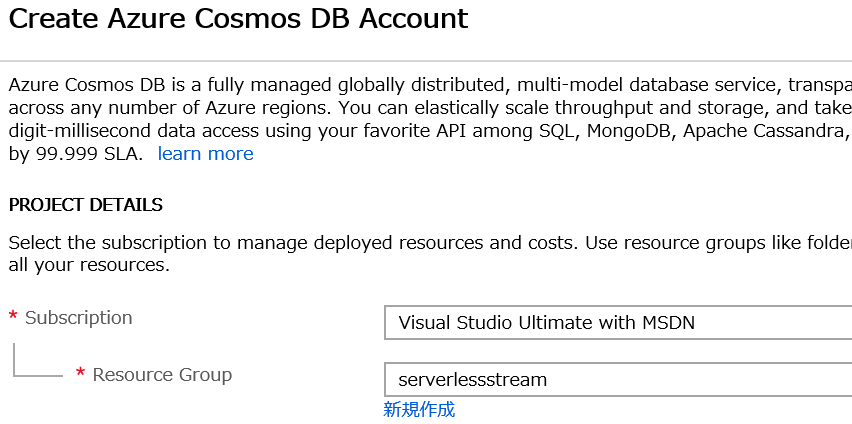
    
1. 名前を指定後、API より「SQL」を選択して、「Review + create」をクリック。最終確認画面で「Create」をクリック。

    

### Function の作成

1.  Azure ポータルに接続。[https://portal.azure.com](https://portal.azure.com)

1. 「リソースの作成」をクリック。

    

1. "function app" と入力して候補から選択。

    

1. Function App を選択。

    

1. 「作成」をクリック。

    

1. アプリ名を指定し、リソースグループは既存のグループを選択。ランタイムスタックでは「.NET」または「JavaScript」を選択。その他の OS、ホスティングプランや場所、Application Insights の場所は以下の画面の通り選択して「作成」をクリック。

    

1. 作成が完了したら、通知またはリソースグループより、作成した Function App へ移動。

    
    
1. 「概要」より「プラットフォーム機能」をクリック。

    
    
1. 「Function App の設定」をクリック。

    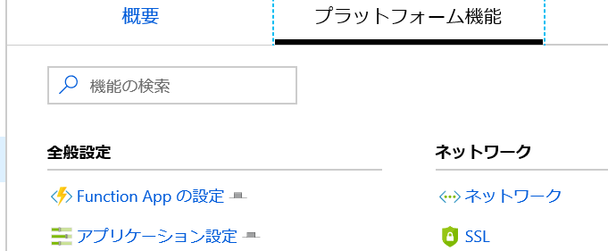
    
1. 「ランタイムバージョン」がバージョン 1.x になっているか確認。2.x になっている場合はバージョンから「~1」をクリック。

    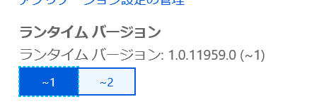

1. 次に関数を作成。画面左側の関数を選択し、「新しい機能」をクリックして関数を作成。

    

1. 検索ボックスに Event Hub を入力し、"Event Hub trigger" テンプレートを選択。

    
    
1. 初めての場合、「拡張機能がインストールされていません」メッセージが出るため、「インストール」を選択。完了したら「続行」をクリック。

    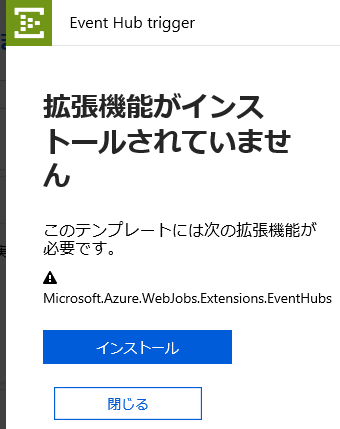

1. イベントハブ接続で「新規」をクリック。

    

1. 作成したイベントハブを選択し、ポリシーで "RootManageSharedAccessKey" を指定後「選択」をクリック。

    

1. イベントハブ名を入力して、「作成」をクリック。

    

1. 左のメニューより「統合」をクリック。

    

1. 「イベントパラメーター名」を後ほど使うのでコピー。

    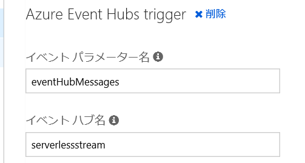

1. 「新しい出力」をクリック。

    

1. Azure Cosmos DB を選んで、「選択」をクリック。

    

1. ドキュメントパラメーター名を「documents」に変更。このオブジェクトが Cosmos DB に格納される。データベース名とコレクション名もそれぞれ変更後、「True の場合、Azure Cosmos DB のデータベースとコレクションを作成します」チェックボックスをチェック。その後「Azure Cosmos DB アカウント接続」の右にある「新規」をクリック。

    

1. 接続画面で作成した Cosmos DB を選んで、「選択」をクリック。

    

1. 元の画面で「保存」をクリック。これでコーディングの準備が完了。

1. 作成した関数名を選択。オンラインのエディタを開く。

    

1. 以下コードでは、受信したイベントを Cosmos DB に格納する。エディターに張り付けて「保存」をクリック。

    JavaScript
    ```javascript
    module.exports = function (context, eventHubMessages) {
        context.log(`JavaScript eventhub trigger function called for message array ${JSON.stringify(eventHubMessages)}`);
        var messages = [];

        eventHubMessages.forEach(message => {
            context.log(`Processed message ${message.description}`);
            messages.push(message);
        });

        context.bindings.documents = messages;
        context.done();
    };
    ```
    C#
    ```csharp
    #r "Newtonsoft.Json"

    using System;
    using Newtonsoft.Json.Linq;

    public static async Task Run(string[] eventHubMessages, IAsyncCollector<dynamic> documents, TraceWriter log)
    {
        log.Info($"C# Event Hub trigger function processed a message: {eventHubMessages}");

        foreach (var eventHubMessage in eventHubMessages){
            log.Info($"Processed message: {eventHubMessage}");
            dynamic doc = JObject.Parse(eventHubMessage);
            await documents.AddAsync(doc);
        }
    }
    ```

1. これでファンクションが実行可能。ファンクションを選択して、概要をクリック。

    

1. 画面下部にある「構成済の機能」より「Application Insights」をクリック。

    

1. 左のメニューより「ライブ メトリックス ストリーム」をクリック。

    

### イベントハブにメッセージを送信

1. 作成済の Function を選択。画面左側の関数を選択し、「新しい機能」をクリックして関数を作成。

    

1. 検索ボックスに manual を入力して検索。「Manual trigger」を選択。

    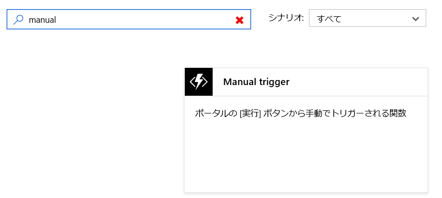

1. 名前を指定して「作成をクリック]

    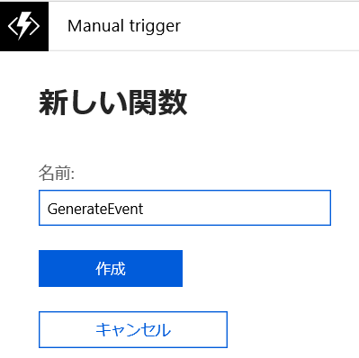

1. 左のメニューより「統合」をクリック。

    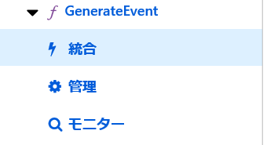

1. 「新しい出力」をクリック。

    
    
1. 「Azure Event Hubs」を選択して「選択」をクリック。

    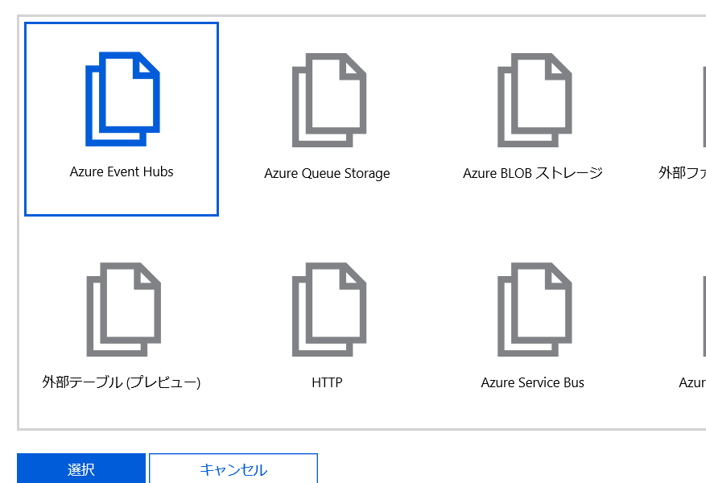
    
1. 「イベント パラメーター名」を「output」に、「イベントハブ名」を「serverlessstream」に変更。イベントハブ接続で「新規」をクリック。

    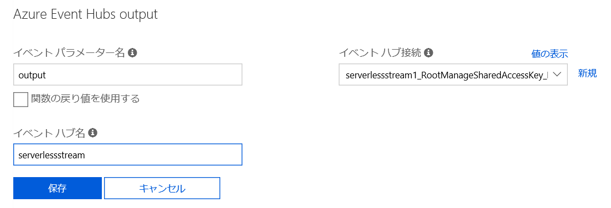

1. 「接続」より、作成した「serverlesssender」ポリシーを指定して「選択」をクリック。その後「保存」をクリック。

    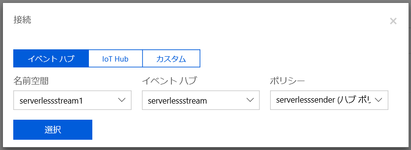
    
1. 関数より「GenerateEvent」をクリックしてオンラインエディターを開き、以下のコードを張り付け。

    Javascript
    ```JavaScript
    module.exports = function (context, input) {
        var message = "{'message':'Test Message'}"
        context.log(message);
        context.bindings.output = message;
        context.done();
    };
    ```
    
    C#
    ```csharp
    using System;

    public static void Run(string input, TraceWriter log, out string outputs)
    {
        var message = "{'message':'Test Message'}";
        log.Info(message);
        outputs = message;
    }
    ```
    
1. 「保存」をクリック後、「実行」をクリック。何度かメッセージを送りたい場合は複数回クリックを実行。

    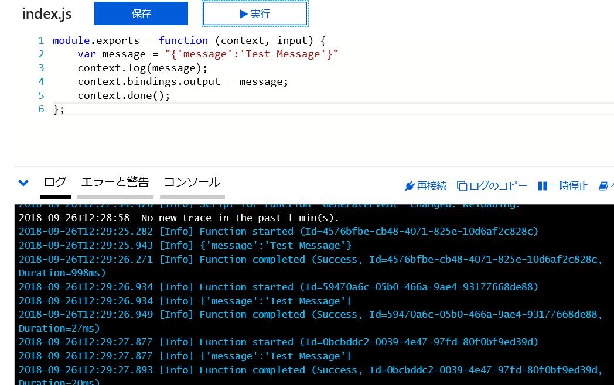
    
1. リソースグループより Cosmos DB を選択し、「Data Explorer」をクリック。

    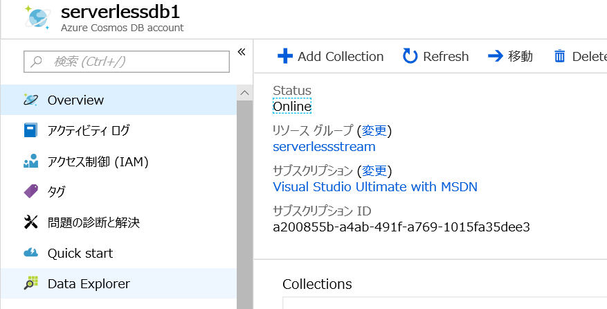
    
1. eventsCollection を展開し、Documents を選択。レコードが作成されていることを確認。

    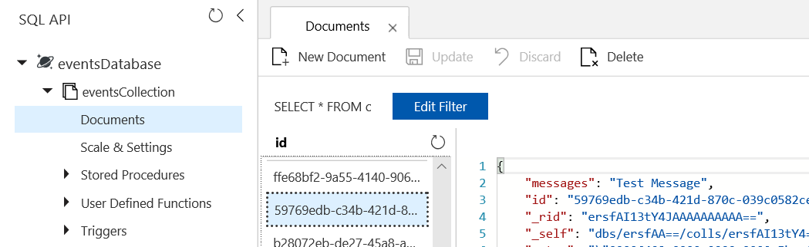

## 2. イベントグリッド経由で Blob ストレージイベントを処理


1. Azure ポータルに接続。[https://portal.azure.com](https://portal.azure.com)

1. 「リソースの作成」をクリック。

    

1. "storage account" と入力して候補から選択。

    

1. 「ストレージ アカウント」を選択。

    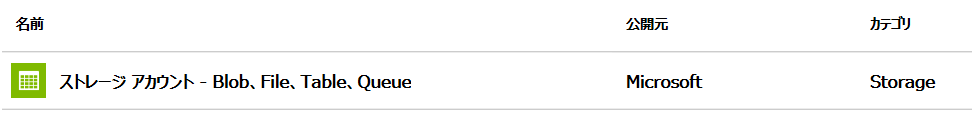

1. 「作成」をクリック。

    
    
1. 「リソースグループ」より新規作成をクリックして、新しくリソースグループを作成。

     

1. ストレージアカウント名、場所を指定。種類では「StorageV2(汎用v2) を選択し、「確認および作成」をクリック。検証が終わったら「作成」をクリック。

    

1. 作成が完了したら、「リソースへ移動」をクリック。

    

1. 概要の画面から、「BLOB」をクリック。

    

1. 「コンテナー」ボタンをクリック。名前を付け、アクセスレベルは既定のまま、「OK」をクリック。

    

1. 作成済の Function App に戻り、関数を選択。「新しい機能」をクリック。

    

1. 検索ボックスに "event grid" と入力して、"Event Grid trigger" を選択。

    

1. 初めての場合は拡張機能のインストールが表示されるので、「インストール」をクリック。
    
    

1. 関数の作成で、「作成」をクリック。

    

1. 次にイベントグリッドのサブスクリプションを作成。ファンクションの画面右上にある「Evet Grid サブスクリプションの追加」をクリック。

    

1. サブスクリプションの名前を入力し、「Topic Type」で「Storage Accounts」を選択。Azure サブスクリプションとリソースグループを選択したら Instance で作成済のブロブストレージを選択。「Subscribe to all event types」のチェックを外し、明示的に項目一覧より「Blob Created」のみ選択。最後に「Suffix Filter」に「.png」を指定して「Create」をクリック。

    

1. 次に CosmosDB へのバインディングを作成するため、「統合」をクリック。

    

1. 「新しい出力」をクリック。

    

1. 「CosmosDb」を選んで「選択」をクリック。

    

1. 各種パラメーターを以下画面の様に更新して、「保存」をクリック。

    

1. 関数を選択してオンラインエディターを開く。

    

1. 以下のコードでイベントグリッドからのイベントを Cosmos DB に保存。エディターに張り付け、「保存」をクリック。

    JavaScript
    ```javascript
    module.exports = function (context, eventGridEvent) {        
        context.log(eventGridEvent);
        context.bindings.document = eventGridEvent.data;
        context.done();
    };
    ```
    C#
    ```csharp
    #r "Newtonsoft.Json"

    using Newtonsoft.Json;
    using Newtonsoft.Json.Linq;

    public static void Run(JObject eventGridEvent, out object document, TraceWriter log)
    {
        log.Info(eventGridEvent.ToString(Formatting.Indented));
        log.Info(eventGridEvent["data"].ToString());    
        document = JObject.Parse(eventGridEvent["data"].ToString());  
    }
    ```

1. これでファンクションが実行可能。ファンクションを選択して、概要をクリック。

    

1.  画面下部にある「構成済の機能」より「Application Insights」をクリック。

    

1. 左のメニューより「ライブ メトリックス ストリーム」をクリック。

    

1. 別のウィンドウで作成したストレージアカウントに移動し、Blob を選択。手動で画像をアップロード。または [Azure Storage Explorer](https://azure.microsoft.com/en-us/features/storage-explorer/) を利用。

    

1. 拡張子が png のものをいくつかアップロード。

    

1. Application Insights より状況を確認。

    
