# Serverless Event Streaming Hands-On Lab

## Event Processing from Event Hub

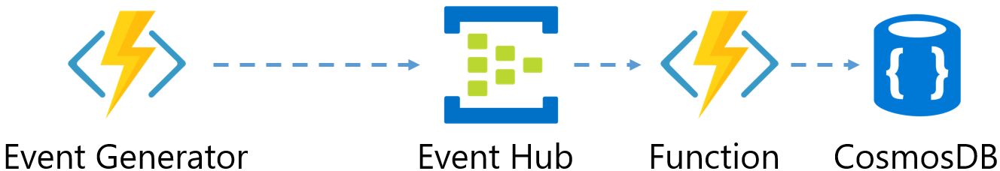

### Create Event Hub

1. Browse to the azure portal [https://portal.azure.com](https://portal.azure.com)
1. Click the New button

    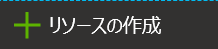

1. Type "event hubs" into the search box and select Event Hub when it pops up

    

1. On the next blade select Event Hubs

    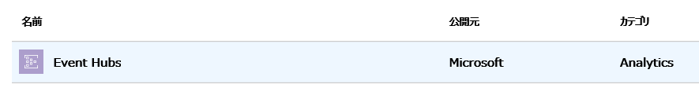

1. Then click "Create"

    

1. Give it a name, location, resource group, location, and scale then click create

    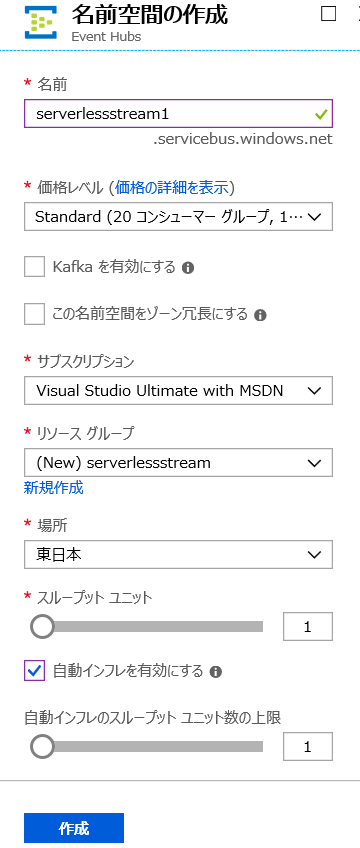

1. When the deployment finishes, we need to create the event hub in the event hub namespace. Click on the "go to resource" button of the deployment notification

    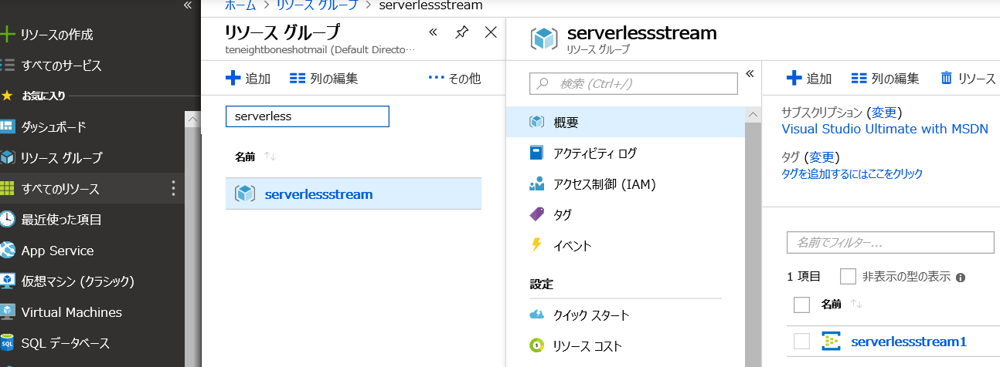

1. Click the "Event Hubs" link under Entities

    

1. Click the New Event Hub button

    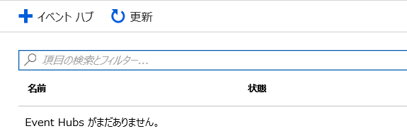

1. Then we can give the event hub a name and leave the rest of the settings as the defaults and click create

    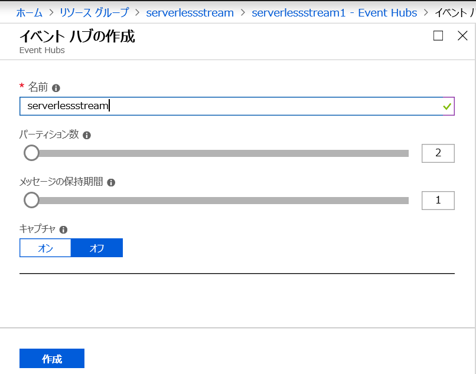

1. Once your event hub entity has been created click on it and then click Shared Access policies

    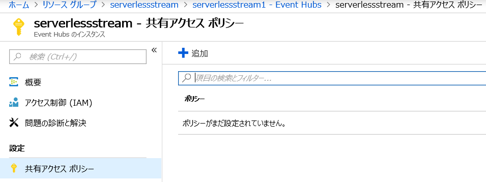

1. Click Add

    

1. Give you policy a name, select the send right, and then click create

    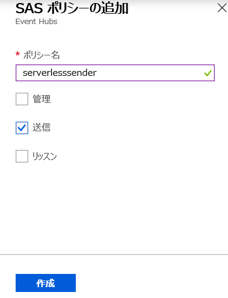

1. Click on the policy you just created and save the Primary Connection String and policy name somewhere as we will need this later

    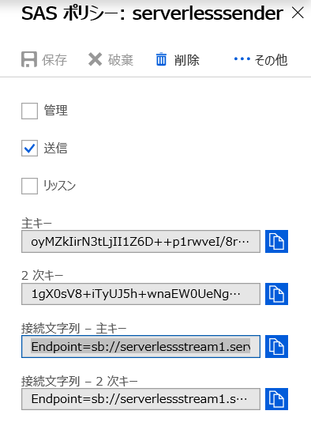

### Create CosmosDB

Now that we have an event hub let's create an instance of CosmosDB where we can put these messages.

1. Browse to the azure portal [https://portal.azure.com](https://portal.azure.com)
1. Click the New button

    

1. Type "Azure Cosmos DB" into the search box and select Azure Cosmos DB when it pops up

    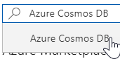

1. On the next blade select Azure Cosmos DB

    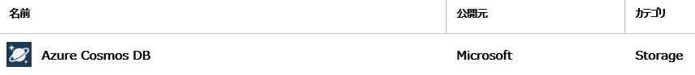

1. Then click "Create"

    

1. Now let's give it a name,  use SQL as the API (since this data is in JSON format already), and use the same existing Resource Group as our Event Hub just to keep everything organized. Then click "Create"

    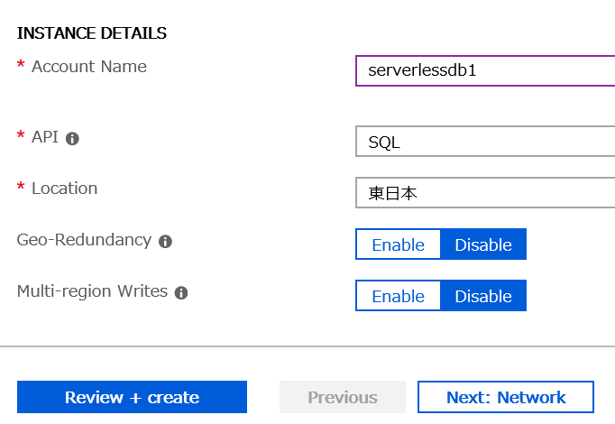

### Create Function

1. Browse to the azure portal [https://portal.azure.com](https://portal.azure.com)
1. Click the New button

    

1. Type "azure functions" into the search box and select Event Hub when it pops up

    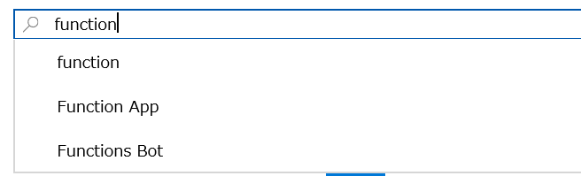

1. On the next blade select Function App

    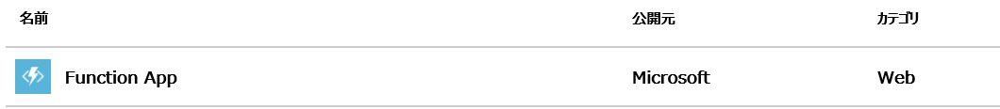

1. Then click "Create"

    

1. On the next screen select a unique name for your function app (confirm with checkmark), again let's use the same existing Resource Group as our Event Hub just to keep everything organized, keep consumption plan selected for the hosting plan, and make sure you choose "On" for Application Insights and then click "Create"

    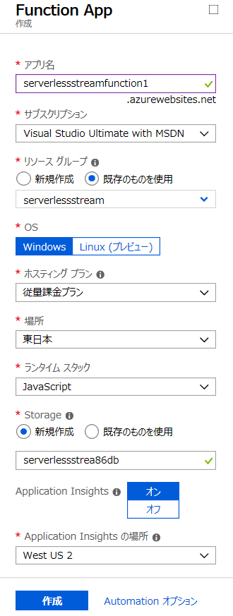

1. When the deployment finshes, we can start writing our function's code. Click on the "go to resource" button of the deployment notification

    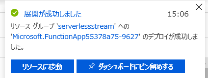

1. Create a new function by clicking on the plus sign next to the functions section on the left

    

1. Then click the link that says create your own custom function

    

1. Type Event Hub in the search box then click the "JavaScript" language option for the "Event Hub trigger" template

    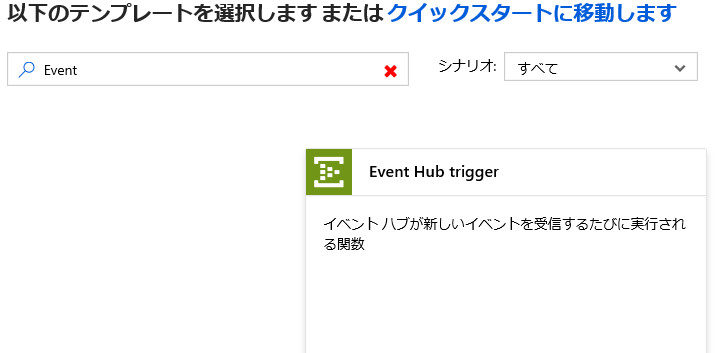

1. Click new for the Event Hub connection

    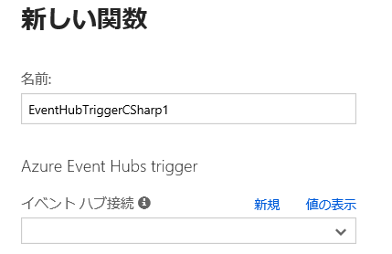

1. Select the Event Hub you set up in the previous step and "RootManageSharedAccessKey" for the policy. Then click Select

    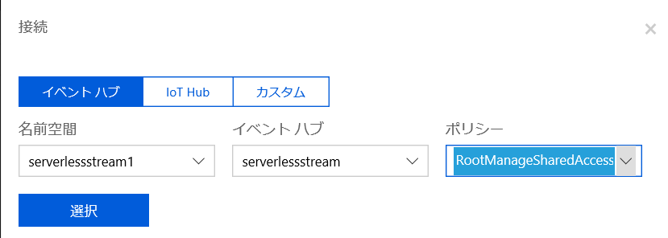

1. Now enter the name of the Event Hub in the Event Hub Name field and then click Create

    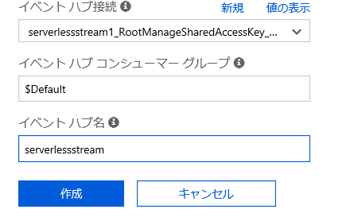

1. Now let's add an output binding for Cosmos DB. Click the integrate link for your function

    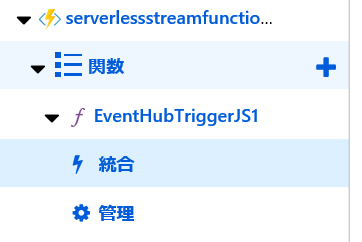

1. Click the "New Output" button

    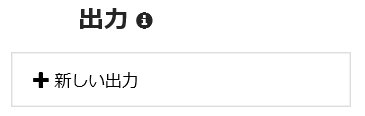

1. Select the CosmosDb output and click the Select button.

    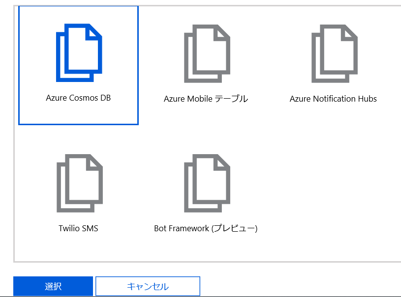

1. Enter a value Document parameter name, this is the object that will be posted to Cosmos DB. Enter a database name and collection name to use and then check the create database and collection check box then click the new button next to the Cosmos DB account connection

    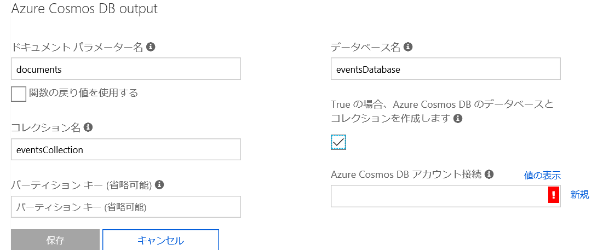

1. On the  and select the cosmos db we set up in the previous step

    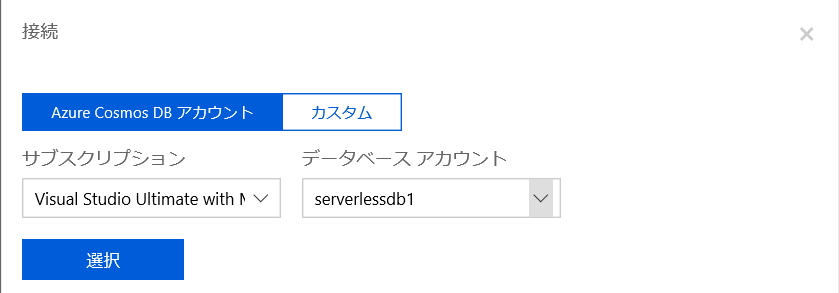

1. Then click "Save" and we are ready to start writing our code!

1. Click on the name of your function. and the code window will open

    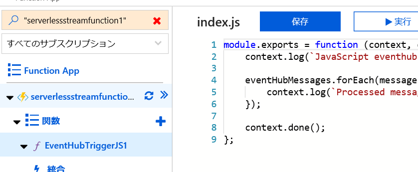

1. Below is the code we will use to insert the events into Cosmos DB

    ```javascript
    module.exports = function (context, eventHubMessages) {
        context.log(`JavaScript eventhub trigger function called for message array ${JSON.stringify(eventHubMessages)}`);
        var messages = [];

        eventHubMessages.forEach(message => {
            context.log(`Processed message ${message.description}`);
            messages.push(message);
        });

        context.bindings.documents = messages;
        context.done();
    };
    ```

    ```csharp
    #r "Newtonsoft.Json"

    using System;
    using Newtonsoft.Json.Linq;

    public static async Task Run(string[] eventHubMessages, IAsyncCollector<dynamic> documents, TraceWriter log)
    {
        log.Info($"C# Event Hub trigger function processed a message: {eventHubMessages}");

        foreach (var eventHubMessage in eventHubMessages){
            log.Info($"Processed message: {eventHubMessage}");
            dynamic doc = JObject.Parse(eventHubMessage);
            await documents.AddAsync(doc);
        }
    }
    ```

1. Now we can start using it. Click on the function app name

    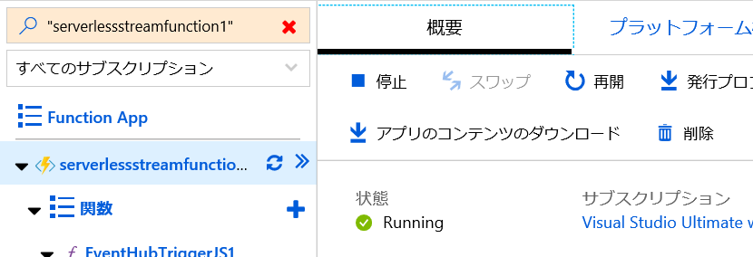

1. Click on the Application Insights link

    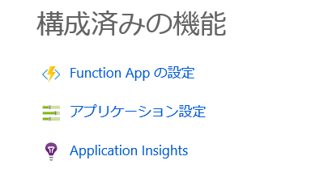

1. Click the Live Stream button

    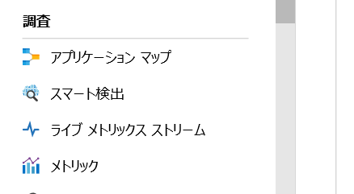

1. In another new window go to [https://aka.ms/eventgen](https://aka.ms/eventgen) in a web browser

1. Select Event Hub as the messaging service

    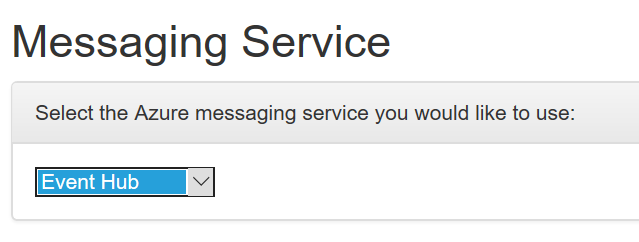

1. Paste in the connection string and event hub name you saved earlier

    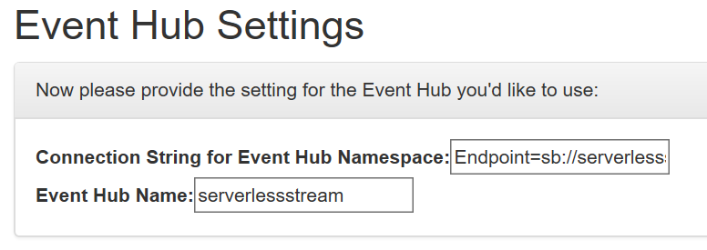

1. Choose Ninja Battle, set the duration to 1 minute, set the frequency to whatever you'd like, and click start!

    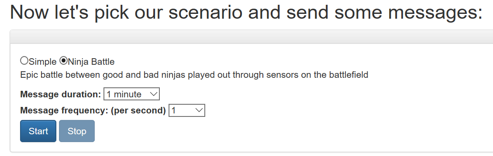

1. Now let's watch the live streaming in Application Insights

    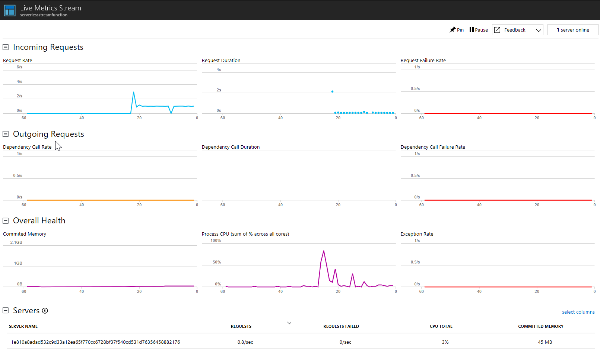

## Blob Storage Events with Event Grid

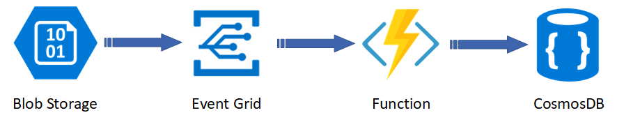

1. Browse to the azure portal [https://portal.azure.com](https://portal.azure.com)
1. Click the New button

    

1. Type "storage account" into the search box and select Storage account when it pops up

    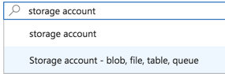

1. Then click "Create"

    

1. Give it a name, a location, and use the same existing Resource Group. Select StorageV2 for the account kind.

    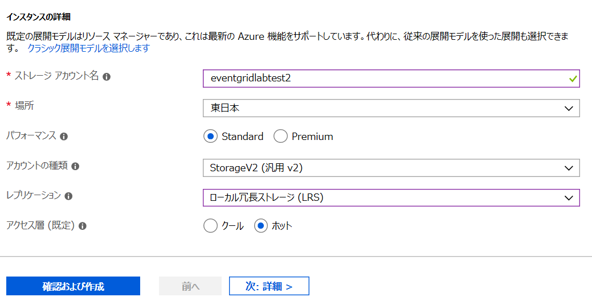

1. When the deployment finshes, click on the "Go to resource" button of the deployment notification.

    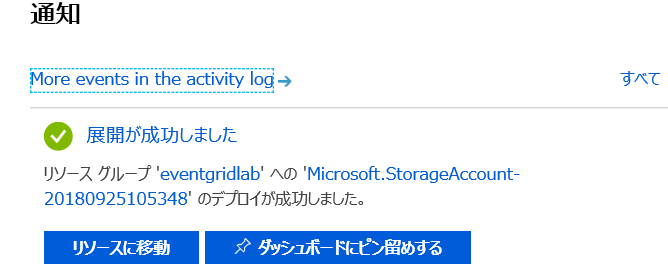

1. Then click on Blobs from the Overview blade.

    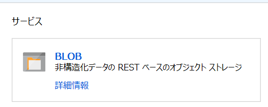

1. Click to add a new Container. Provide a name for the container and leave the access level set to Private.

    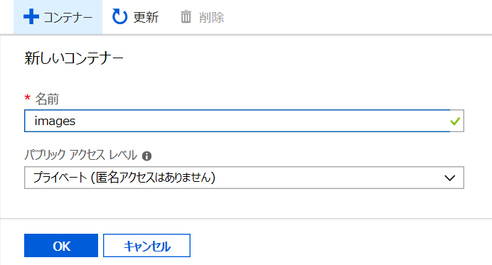

1. Go back to the Function App and create a new function by clicking on the plus sign next to the functions list on the left.

    

1. type "event grid" in the search box and click on the Javascript link of the "Event Grid trigger"

    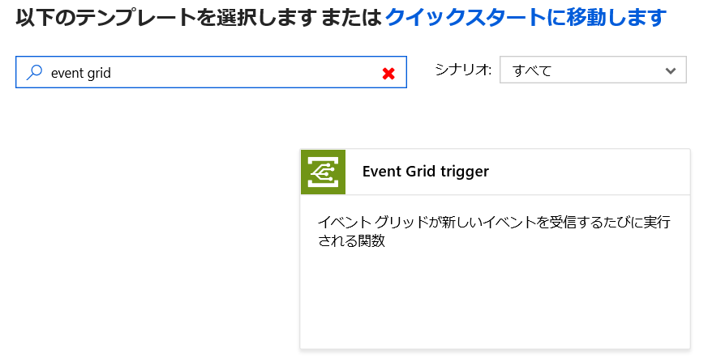

1. Give your function a name and click "Create"

    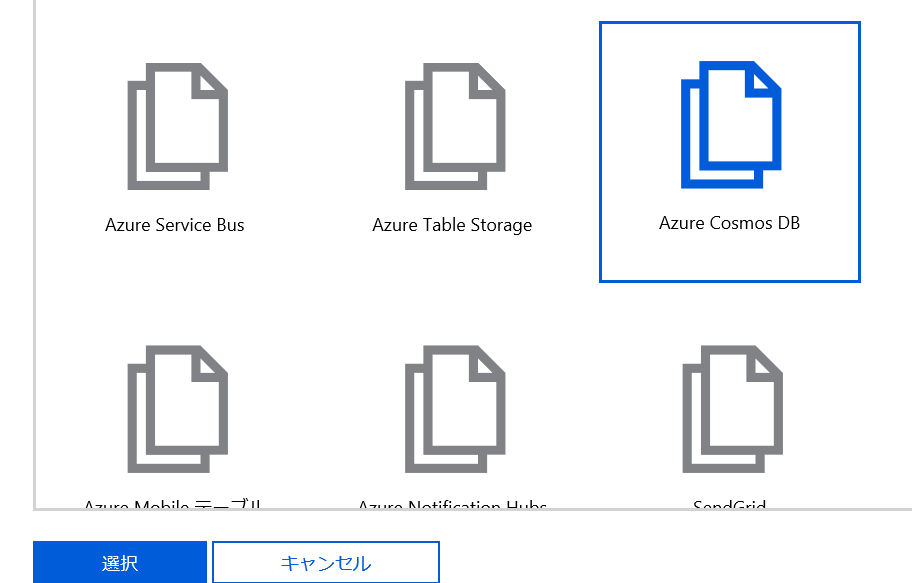

1. Now let's setup the Event Grid subscription. Start by clicking on the "Add Event Grid subscription" link in the upper right-hand corner

    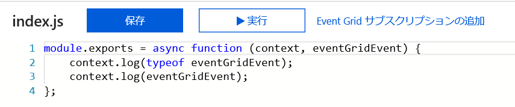

1. In the menu that opens: enter a Name for the subscription, set the Topic Type to "Storage Accounts", make sure the correct subscription, resource group, and storage account instance are selected. Uncheck the "Subscribe to all event types" box and choose the "Blob Created" type. Lastly, add a suffix filter for .png files and click Create.

    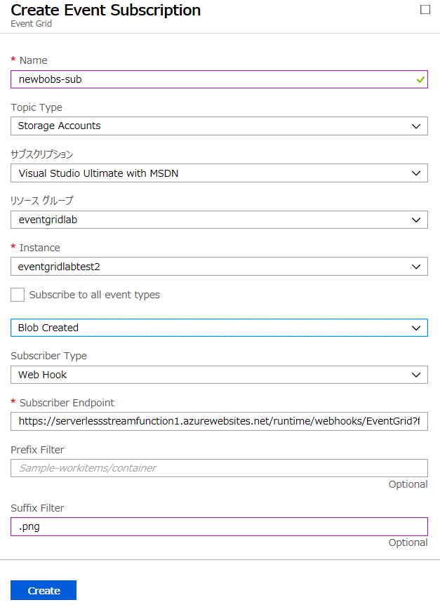

1. Now let's add an output binding for Cosmos DB, just like we did before with the Event Hub. Click the integrate link for your function

    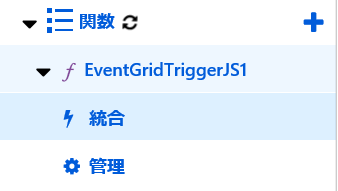

1. Click the "New Output" button

    

1. Select the CosmosDb output and click the Select button

    

1. Select the "Use function return value" checkbox. Enter a database name and collection name to use and then check the create database and collection check box then click the new button next to the Cosmos DB account connection. Then click "Save" and we are ready to start writing our code!

    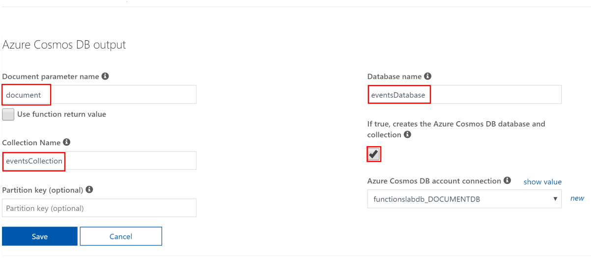

1. Click on the name of your function. and the code window will open

    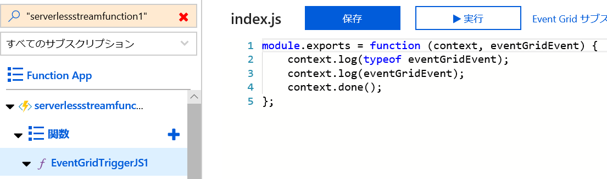

1. Below is the code we will use to insert the events into Cosmos DB

    ```javascript
    module.exports = function (context, eventGridEvent) {
        context.log(eventGridEvent);
        context.done(null, eventGridEvent);
    };
    ```

1. Now we can start using it. Click on the function app name

    

1. Click on the Application Insights link

    

1. Click the Live Stream button

    

1. In a new window or browser tab, go to the container we created earlier for the storage account and click on the Upload link. You are also welcome to use a tool like [Azure Storage Explorer](https://azure.microsoft.com/en-us/features/storage-explorer/)

    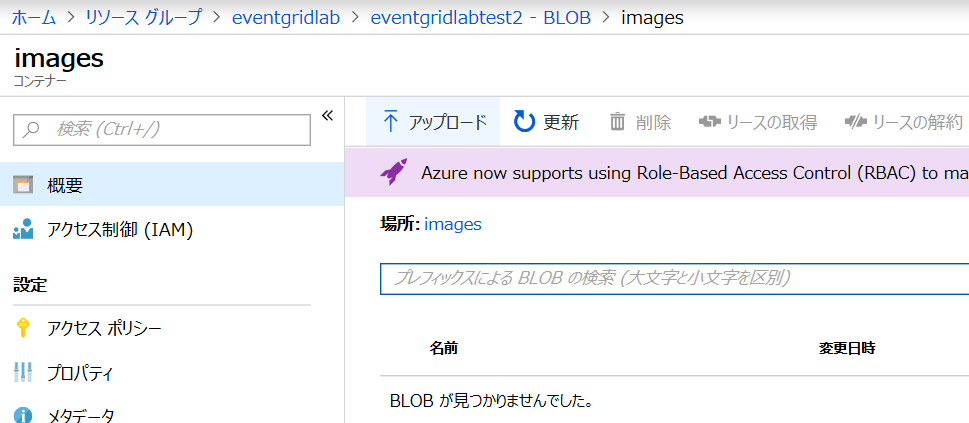

1. Upload one or more files, at least a few with the .png extension

    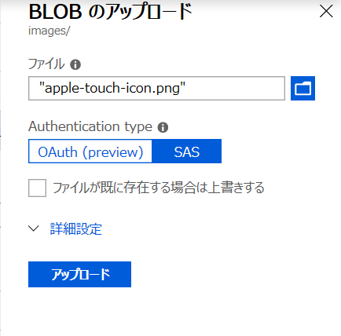

1. Now let's watch the live streaming in Application Insights

    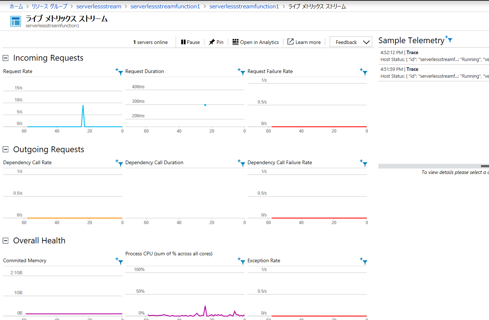