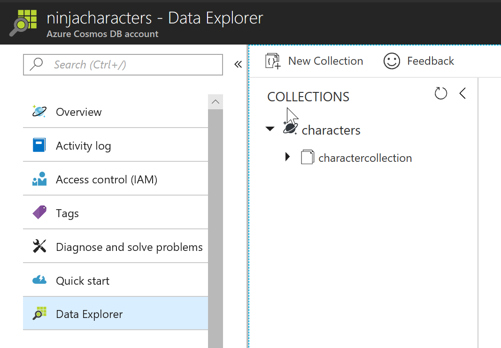
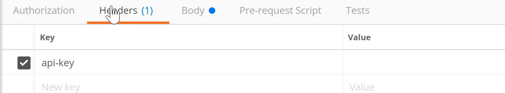
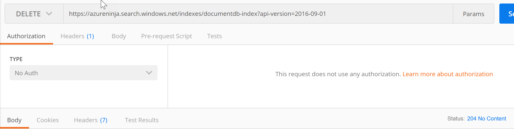
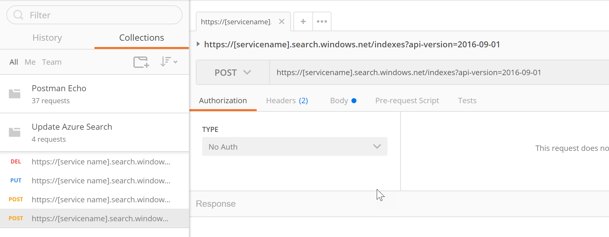
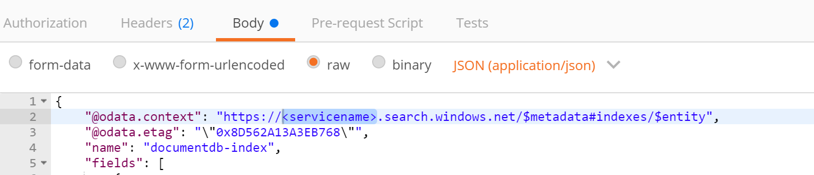
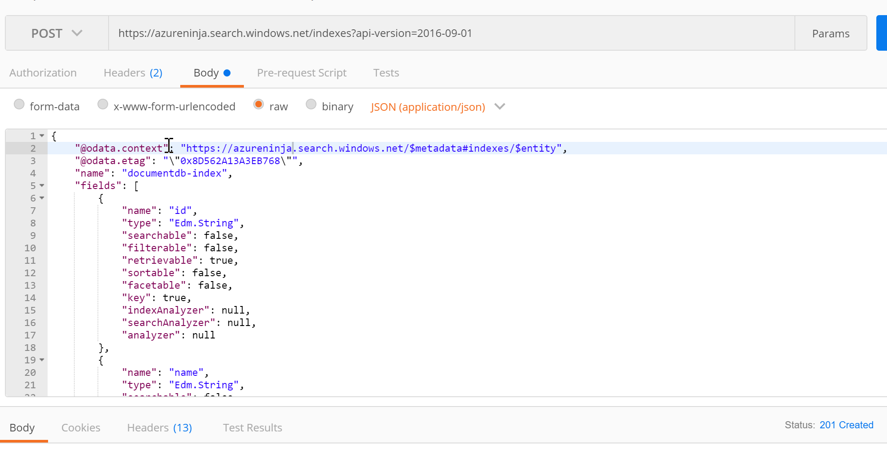
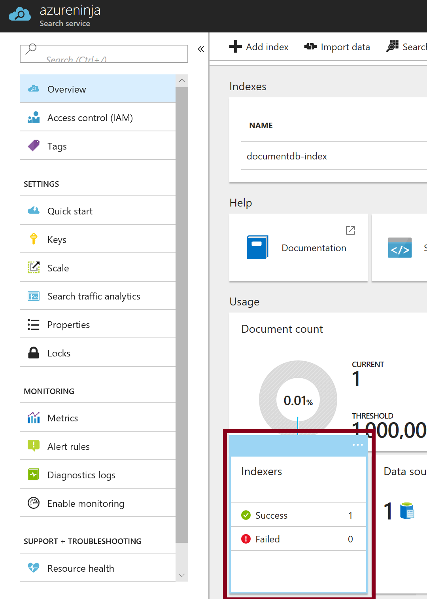
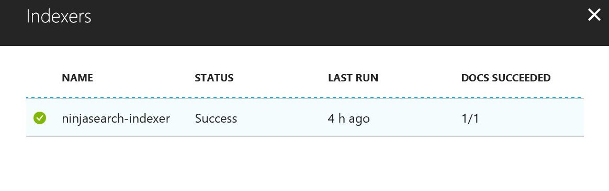

## Clear Data from CosmosDB

This should be done before each demo demo.

1. Browse to the azure portal [https://portal.azure.com](https://portal.azure.com)

1. Go to the Data Explorer of you CosmosDB database.

	
	
1. Click on collection name -> documents.  Ensure that the filter is "SELECT * FROM c".  Select all the documents on the page and press the delete button.

	

	
## Clear Azure Search (Postman)

1. Browse to the azure portal [https://portal.azure.com](https://portal.azure.com)

1. Open your Azure Search instance and select Keys.  Copy the Primary Admin Key.

	

1. Open your Azure CosmosDB instance and select Keys.  Copy the Primary Admin Key.  Save the value.

	

1.  Open the following collection in Postman.

[](https://app.getpostman.com/run-collection/7cbb2535dc67fe3e510b)
	
1.  Select the PUT method from the list.

	
	
1.  Select the headers tab.  Enter the Primary Admin Key as the api-key.

	
	
1.  Select the body tab.  Change the values to match the names of your services.  The image shows the values given for the this example.  More information on the REST calls of 
	Azure Search for Data Source can be found here:  [https://docs.microsoft.com/en-us/rest/api/searchservice/create-data-source](https://docs.microsoft.com/en-us/rest/api/searchservice/create-data-source)

	```json
     {
	    "container": {
		"name": "<Cosmos SQL API collection>"
	 },
	"credentials": {
		"connectionString": "AccountEndpoint=https://[your account name].documents.azure.com;AccountKey=[your cosmos db primary account key];Database=[your database id]"
	},
	"name": "<Search Data Source>",
	"type": "documentdb",
	  "dataChangeDetectionPolicy" : 
	  {"@odata.type" : "#Microsoft.Azure.Search.HighWaterMarkChangeDetectionPolicy",  
    "highWaterMarkColumnName" : "_ts" 
	}
	}
	```

	

1.  Change the URL to be the correct service names select SEND.  A 204 code will be returned.  

	https://<b>search service name</b>.search.windows.net/datasources/<b>data source name</b>?api-version=2016-09-01.    

	

1.  Now the indexer needs to be updated. Select the first POST listed in the collection.  Ensure that the URL contains indexers.

	

1.  Select the headers tab.  Enter the Primary Admin Key as the "api-key" value.

	

1.  Update the URL with the correct values and select SEND.  A 202 code will be returned.

	  https://<b>search service name</b>.search.windows.net/indexers/<b>indexer name</b>/run?api-version=2016-09-01.  

	

1.  Now the index needs to be delete and recreated. Select the DEL listed in the collection.

	

1.  Select the headers tab.  Enter the Primary Admin Key as the "api-key" value.

	

1.  Update the URL with the correct values and select SEND.  A 204 code will be returned.
	
	  https://<b>service name</b>.search.windows.net/indexes/<b>index name</b>?api-version=2016-09-01.  

	

1. Select the second POST listed in the collection.  Ensure that the URL says indexes.

	

1.  Select the headers tab.  Enter the Primary Admin Key as the "api-key" value.

	

1. Select the body tab and update the servive name in the first line of the code.

	

1.  Update the URL with the correct values and select SEND.  A 201 code will be returned.

	  https://<b>servicename</b>.search.windows.net/indexes?api-version=2016-09-01.  

	

## Clear Azure Search (Portal)

If you do not have Postman, you can also clear the Azure Search Index through the Portal

1. Browse to the azure portal [https://portal.azure.com](https://portal.azure.com)

1. Open your Azure Search instance and click the Indexers box.

	
	
1. Select the indexer.

	
	
1. On the indexer page, press Run.

	
	
1. Select "Yes" to run the Indexer now.

	
	