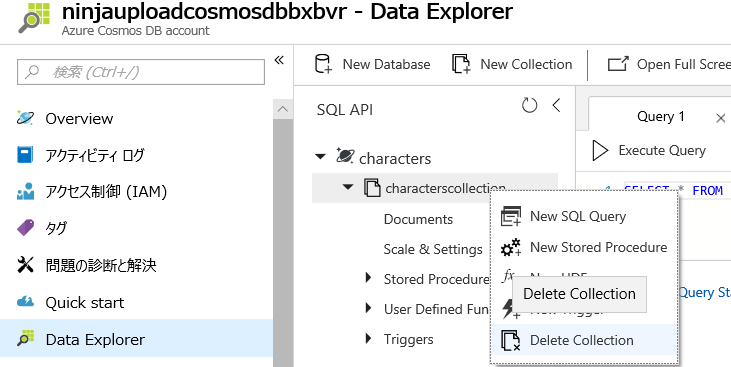
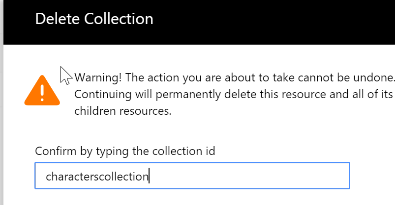
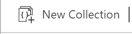
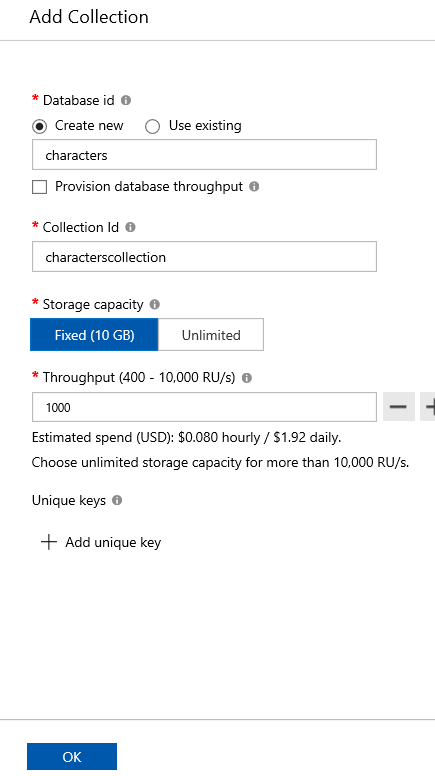

# Clean Up Demo Environment After Demo

## Clear Data from CosmosDB

This should be done before each demo.

1. Browse to the azure portal [https://portal.azure.com](https://portal.azure.com)

1. Go to the Data Explorer of you CosmosDB database.

   

1. Right Click on collection name and select Delete Collection.

   

1. Type in the name of the collection and select OK.

   

1. Click "New Collection"

    

1. In the blade on the right hand side, give the database a name, the collection a name, and ensure that storage capacity is set to fixed.  Then press "OK".

    