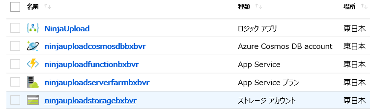
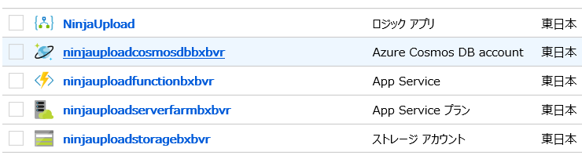
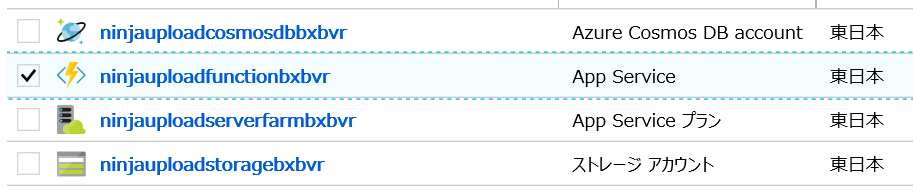
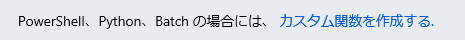
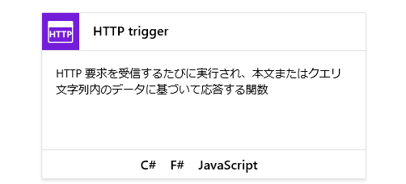
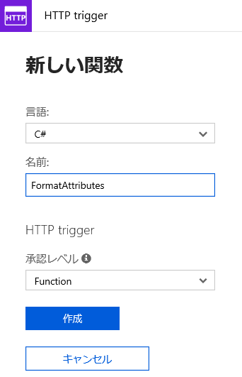

# サーバーレス Logic App デモ環境セットアップ

セットアップ対象:  Azure ストレージアカウント、Cosmos DB、Azure Search
デモ実施の前に行ってください。

## Deployment テンプレートの更新

1. [deployment.json](deployment.json) ファイルをエディターで開く。

1. ファイルをローカルに保存。

## テンプレートを使用して、Azure ストレージアカウント、Cosmos DB およびファンクションを作成

1. Azure ポータルに接続。https://portal.azure.com
1.「リソースの作成」をクリック。

    

1. 検索ボックスに "template" 入力し、候補より選択。

    

1. 次の画面で「テンプレートのデプロイ」を選択。

    

1. 「作成」をクリック。

    

1. 「エディターで独自のテンプレートを作成する」をクリック。

    

1. 「ファイルの読込み」をクリック。

    

1. 先ほど保存した [deployoment.json](deployment.json) ファイルを指定。

    

1. 保存をクリック。

    

1. リソースグループなど変数に値を指定。使用条件に同意して「購入」をクリック。

    

1. 展開が終わったら、通知より「リソースグループに移動」をクリック。

    

## ストレージアカウントのコンテナを作成

Logic App を起動するトリガーとしてファイルのアップロードを利用します。ここではそのためのストレージアカウントを設定します。

1. リソースグループに作成されたリソース一覧より、ストレージアカウント選択。
    

1. BLOB をクリック。

    

1. 「コンテナー」をクリック。

    

1. 新しいコンテナー画面で、名前を指定し、「パブリックアクセスレベル」で「コンテナー (コンテナーと BLOB の匿名読み取りアクセス)」を選択して、「OK」をクリック。

    

1. [Azure ストレージエクスプローラー](https://azure.microsoft.com/en-us/features/storage-explorer/) をダウンロードしてインストール。

## Cosmos DB のコレクション作成

次にファイルアップロード後にメッセージを保存する Cosmos DB のコレクションを作成します。

1. リソースグループより Azure Cosmos DB アカウントを選択。

    

1. 「Overview」より「Add Collection」をクリック。

    

1. データベース名、コレクション名を入力。ストレージの容量を Fix にして「OK」をクリック。

    

## ファンクションの作成

1. リソースグループよりファンクション (App Service) を選択。

    

1. 「関数」の横にあるプラスをクリック。

    

1. 「カスタム関数を作成する」リンクをクリック。

    

1. 「HTTP Trigger」タイルで C# をクリック。

    

1. 名前を指定して「作成」をクリック。

    

1. [attributemapfunction.txt](setup_data/attributemapfunction.txt) よりコードをコピーして、エディターにペースト後、保存。

    

## 統合アカウントの作成

1.  Azure ポータルに接続。https://portal.azure.com

1.「リソースの作成」をクリック。

    

1. 検索ボックスに "integration account" と入力して候補から選択。

    

1. 次の画面で「統合アカウント」を選択。

    

1. 「作成」をクリック。

    

1. 名前を指定し、既存のリソースグループを選択。「基本」価格レベルを選択して、「作成」をクリック。

    

1. 作成が終わったら、通知より「リソースに移動」をクリック。

    

1. 「マップ」タイルを選択。

    

1. 「追加」をクリック。

    

1. 名前を指定し、マップの種類で「Liquid」を指定。[TransformCharacters.liquid](setup_data/TransformCharacters.liquid) をローカルに保存して、「マップ」ファイルに指定。「OK」をクリックして作成。
   
    

以上でデモ用のセットアップは完了です。
