# サーバレス Logic App デモ

このデモは Logic App の説明中に利用するものです。データは異なるものの、このデモは実際のシナリオに基づいた実装となります。

以下の Logic App はマーベル社のデータベースにあるキャラクターの一覧をアップロードします。リストは JSON ドキュメントであり、キャラクターの特性を記したテキストファイルです。

ファイルがアップロードされると、各キャラクターのデータは Cosmos DB に格納され、その後 ”Ninja” というキーワードで検索が行われます。

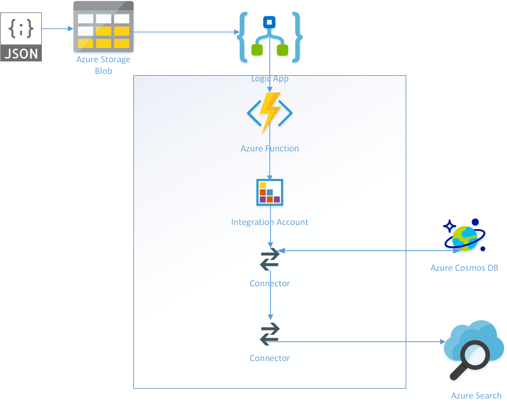

<b>少なくとも [Logic App デモのセットアップ](LogicAppDemoSetup.md) を一度は行ってから、このデモを試してください。同じデモを試す場合は、Cosmos DB のデータを [データの削除手順](ClearData.md) から消去してから行ってください。</b>

## デモのビデオ

以下のリンクよりデモのビデオがダウンロードできます。

[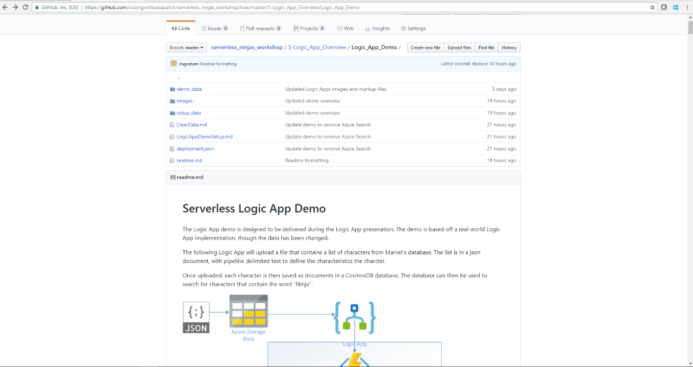](LogicAppDemo.mp4)

## Azure ストレージエクスプローラー

このデモでは [Azure ストレージエクスプローラー](https://azure.microsoft.com/en-us/features/storage-explorer/) を使います。必須ではありませんが是非利用してください。ツールにログインする際は、環境構築で使ったアカウントを利用してください。

## Logic App の作成
1. Azure ポータルに接続。 [https://portal.azure.com](https://portal.azure.com)
1. 「リソースの作成」をクリック。

    

1. 検索ボックスに "Logic App" と入力して候補から選択。

    

1. 次の画面で Logic App を選択。

    

1. 「作成」をクリック。

    

1. 名前を指定し、リソースグループを指定。場所を選択して、「作成」をクリック。

    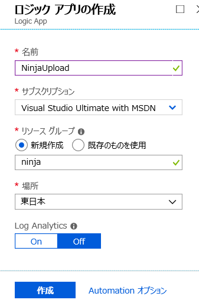

1. 作成が完了したら、通知より「リソースに移動」をクリック。

    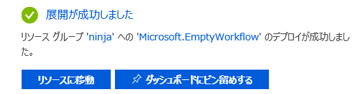

1. Logic App デザイナーが開くが、統合アカウントを利用の設定をまず行うため、上部のリンクより作成した Logic App の名前をクリック。統合アカウントについては [統合アカウントのドキュメント](https://docs.microsoft.com/ja-jp/azure/logic-apps/logic-apps-enterprise-integration-create-integration-account) を参照。

    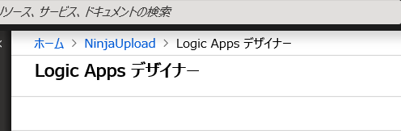

1. メニューより「ワークフロー設定」をクリック。

    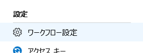

1. 設定画面より、「統合アカウント」の欄で、セットアップで作成したアカウントを指定。

    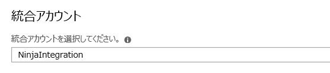

1. 「保存」をクリック。

    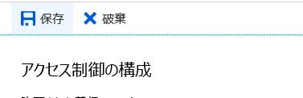

1. 「ロジック アプリ デザイナー」をクリック。

    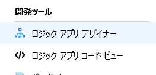

1. 「ロジック アプリ デザイナー」から様々なテンプレートを利用可能。ここでは「空のロジックアプリ」テンプレートから作成。

    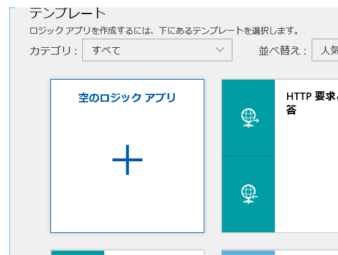

### Azure ストレージアカウント BLOB トリガー

1. デザイナーが開くと、トリガーの選択が表示されるので、「blob」を検索。

    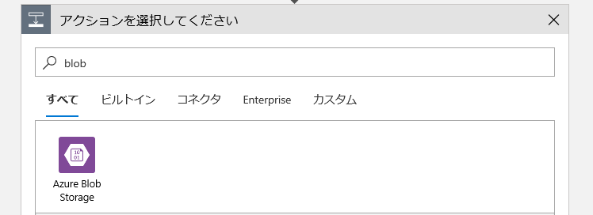

1. トリガーより「Azure Blob Storage」を選択。

    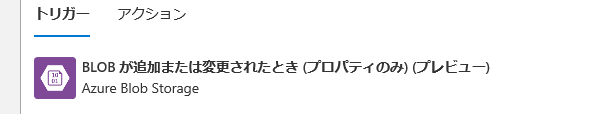

1. 接続名を入力して、セットアップで作成したストレージアカウントを選択。「作成」をクリック。

    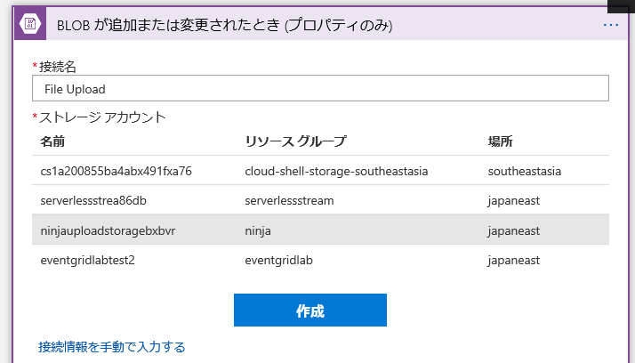

1. 「コンテナー」項目の右側にあるフォルダーアイコンをクリックし、作成済のコンテナを指定。間隔は既定の 3 分のままにしておく。

    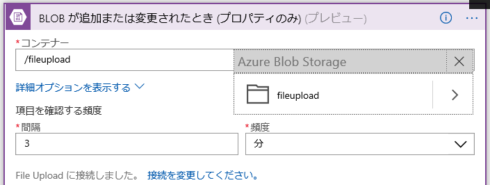

### Azure ストレージのコンテンツ取得

作成したトリガーは Blob コンテナーにアイテムがアップロードされた事だけが通知されるため、コンテンツは別途取得する必要があり〼。

1. 「新しいステップ」をクリック。

    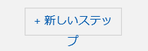

1. 検索ボックスに blob と入力して検索。

    

1. 「アクション」より「BLOB コンテンツの取得」を選択。

    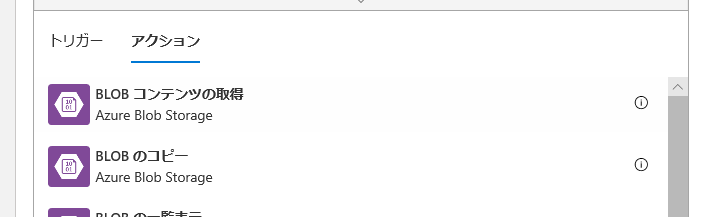

1. BLOB 欄をクリックして、動的なコンテンツより「ファイルの一覧 Path」を選択。動的なコンテンツを利用すると、これまでのステップで得た値が選択可能。

    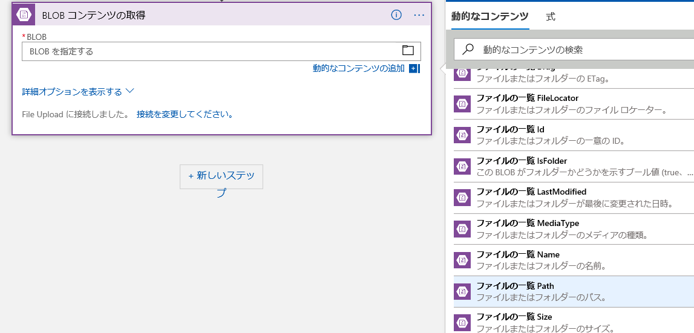

### JSON ファイルのパース

JSON のパースは Logic App でよく利用されるアクションで、パースされたプロパティは以降のアクションで利用が可能になります。

1. 「新しいステップ」をクリック。

    

1. 検索ボックスに json と入力して検索。「データ操作」をクリック。

    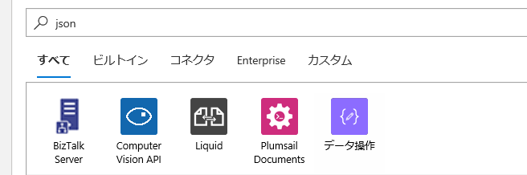

1. アクションより「JSON の解析」を選択。

    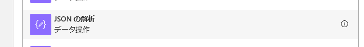

### Expression Editor    

入力データは JSON フォーマットですが、受信したデータの型は JSON 文字列ではないため、「式」の機能で変換します。

1. 「コンテンツ」テキストボックスをクリック。右側に出るメニューより「式」タブをクリック。

    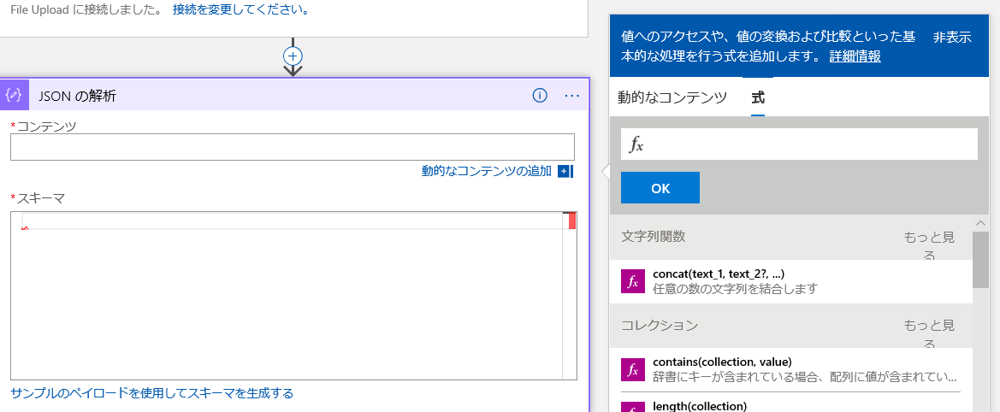

1. 「変換関数」にある「json(value)」を選択。

    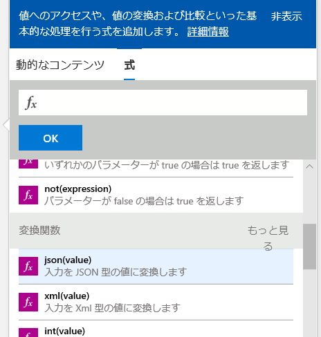

1. 「動的なコンテンツ」タブをクリックして、「ファイルのコンテンツ」を選択。「OK」をクリック。

    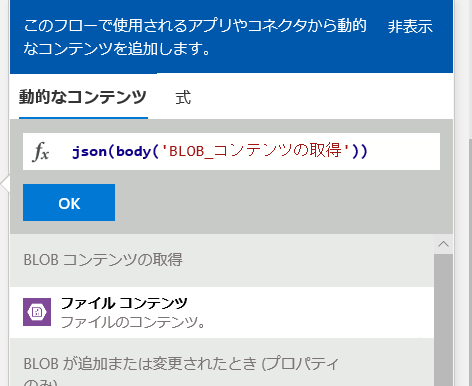

1. 次にスキーマのテキストボックス下部にある「サンプルのペイロードを使用してスキーマを生成する」をクリック。これで実際のデータからスキーマを自動生成可能。

    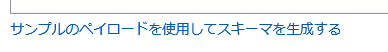

1. [sampleschema.json](setup_data/sampleschema.json) の中身を張り付けて、「完了」をクリック。

    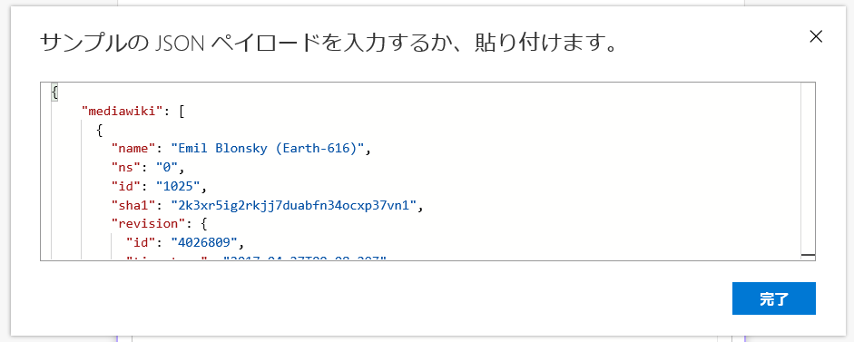
    
1. スキーマが生成されることを確認。

    

## データを Cosmos DB に送信

データの取得をした次は、結果を Cosmos DB に保存します。データはファンクションを使って分割してから格納します。

### ファンクションの追加。

1. 「新しいステップ」をクリック。

    

1. 検索ボックスで azure function を検索。

    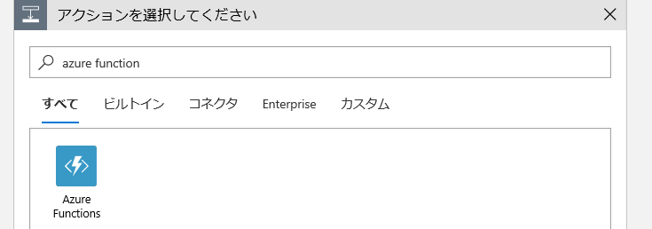

1. アクションより「Azure 関数を選択する」をクリック。

    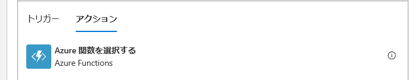

1. ファンクションの一覧が表示されるため、事前に作成したファンクションを選択。

    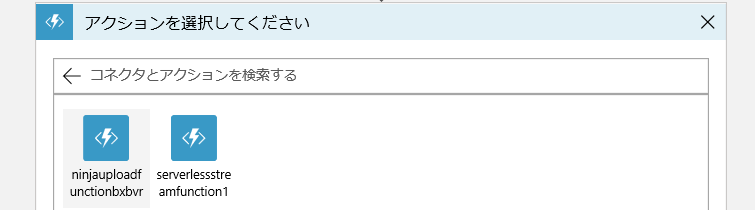

1. アクションの下で利用する関数をクリック。

    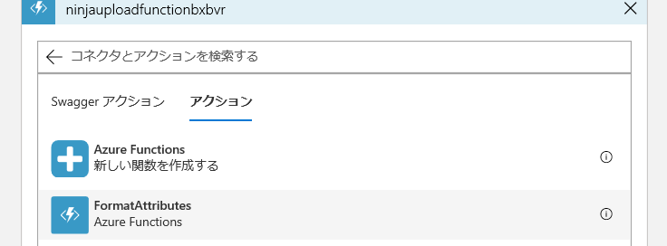

1. 「要求本文」をクリックして、「動的コンテンツ」より「text」を選択。

    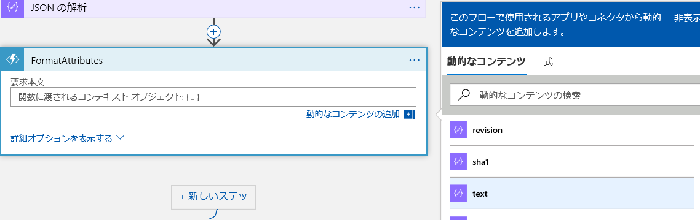

1. 自動的に「For each」コンテナが作成される事を確認。

    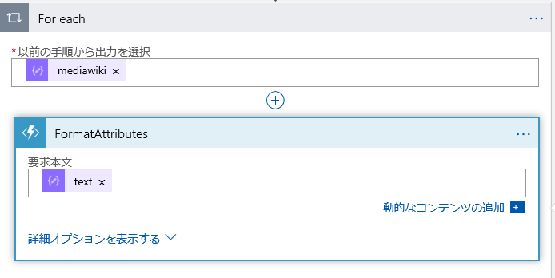

### Liquid マップ

JSON ドキュメントのプロパティはこれで取得できました。次に作成済のマップを利用して必要なデータを取得します。

1. 「For each」の一番下にある「アクションの追加」をクリック。

    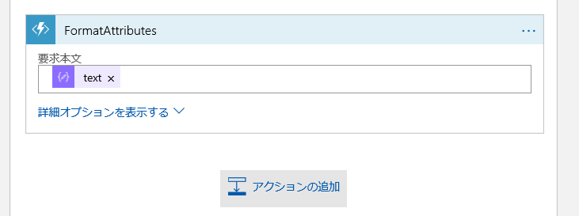

1. 検索ボックスで liquid を検索。

    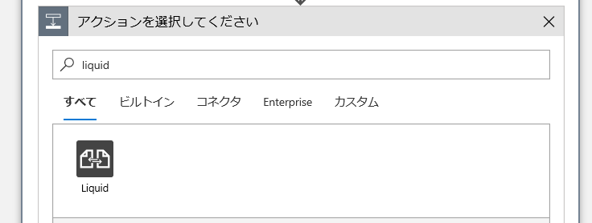

1. アクションから「JSON を JSON に変換」を選択。

    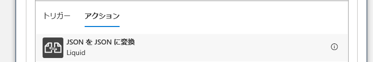

1. マップのドロップダウンより、作成済の統合アカウントよりマップを選択。

    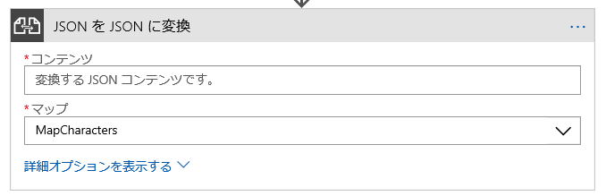

### コードビュー

GUI から選択が困難な場合、コードビューを利用して直接コードを記述することが出来ます。

1. 「JSON を JSON に変換」アクションの「コンテンツ」を選択した後、画面上部にある「コードビュー」をクリック。

    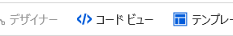


1. 「JSON_を_JSON_に変換」項目を探して、input -> content の値を以下のコードに差し替え。

```logic app code
@addProperty(items('For_each'), 'attributes', body('FormatAttributes'))
```

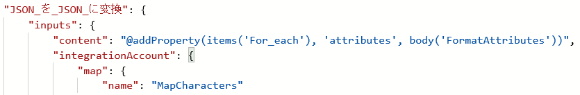

1. 「デザイナー」をクリックして元の画面に戻る。

    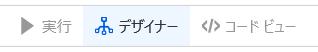

### Cosmos DB 接続

1. 「For each」の一番下で「アクションの追加」をクリック。

    

1. 検索ボックスで cosmos と入力。

    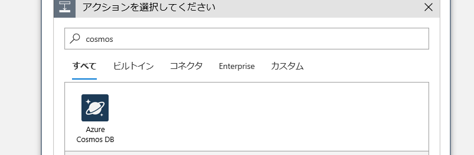

1. アクションより「ドキュメントを作成または更新する」を選択。

    

1. 接続名を入力して、一覧より事前に作成した Cosmos DB を選択。「作成」をクリック。

    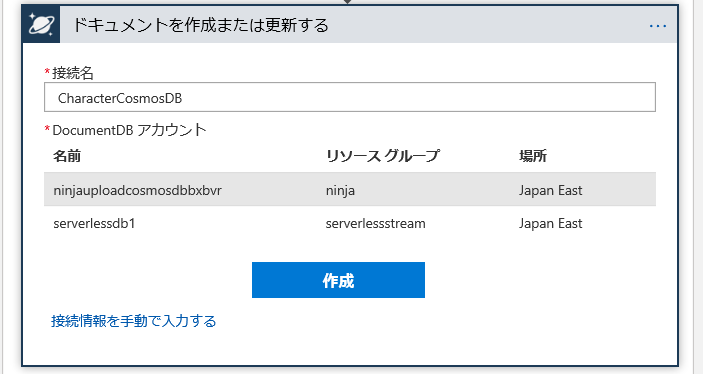

1. 「データベース ID」と「コレクション ID」を選択。

    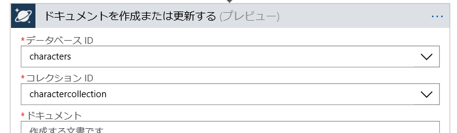

1. 「ドキュメント」のテキストボックスをクリックして、「変換後のコンテンツ」を選択。

    
    
以上で Logic App の開発は終わりです。

## デモの実行

1. Logic App を保存。

    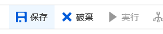

1. 保存したらデザイナーを閉じる。

    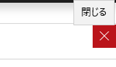

1. Azure ストレージエクスプローラーを開いて、作成したストレージアカウントを開く。

    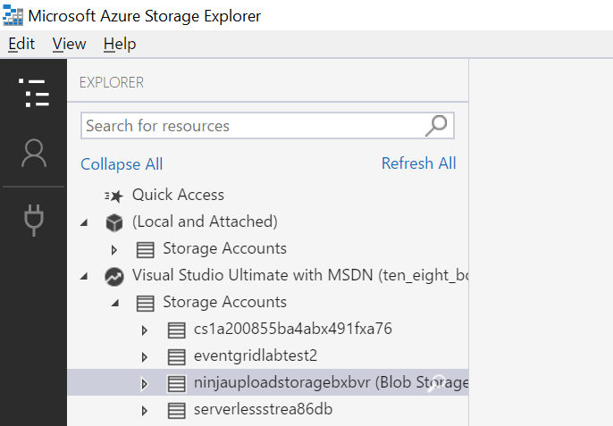

1. Blob Containers を展開してコンテナーを選択。

    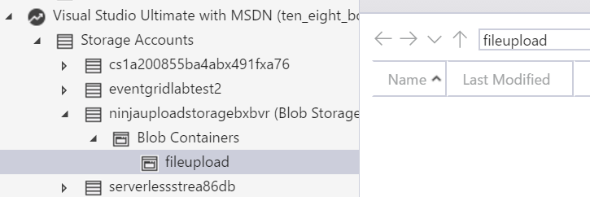

1. [Characters.json](demo_data\characters.json) ファイルをローカルにコピーしてアップロード。

    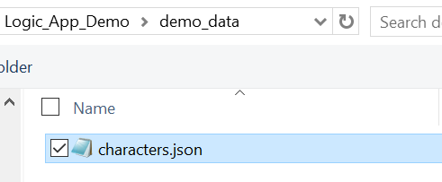

1. Log App の画面に戻って「トリガーの実行」より「BLOB が追加または更新された時」をクリック。

    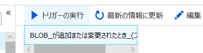

1. 「最新の情報に更新」をクリック。

    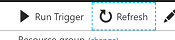

1. 履歴で「成功」が出るまで更新。

    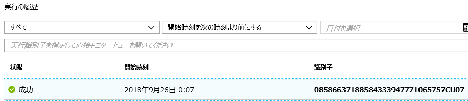

1. 成功のログをクリックして詳細を確認。成功したステップは緑のチェックが表示され、中身も確認可能。

    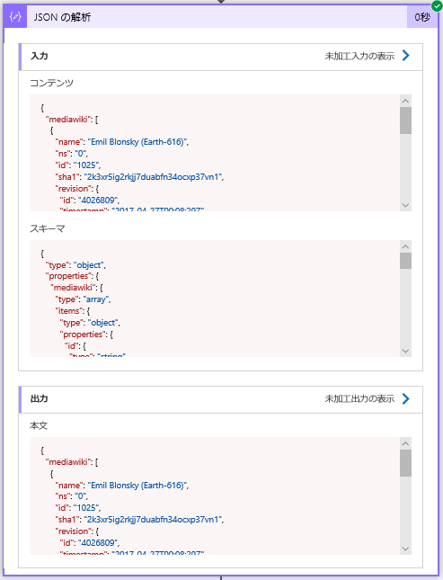

1. Cosmos DB に接続して、「Data Explorer」より以下クエリにてデータを確認。

```sql
SELECT * FROM c WHERE ARRAY_CONTAINS(c.Attributes.Category, 'Ninjas')
```
