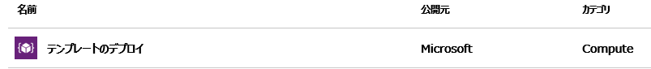
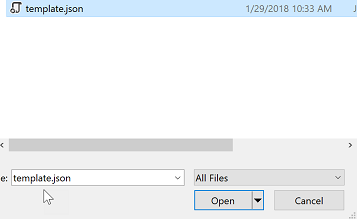
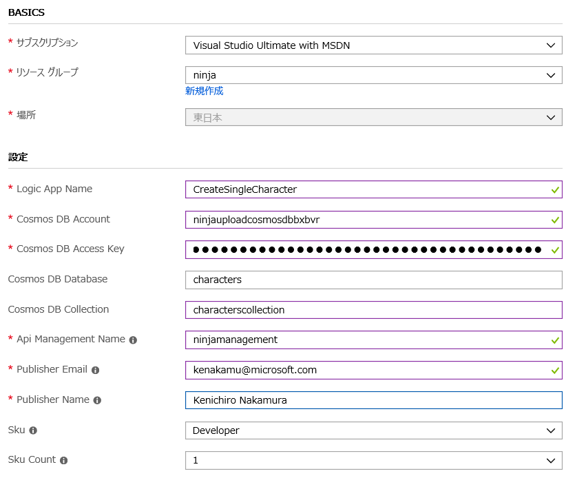
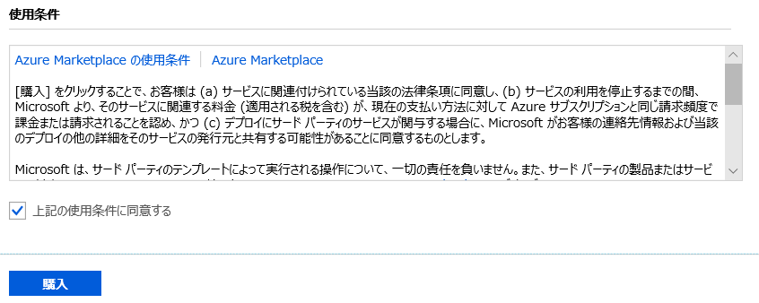
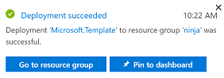
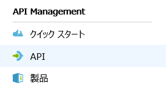
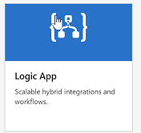
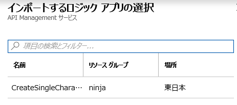
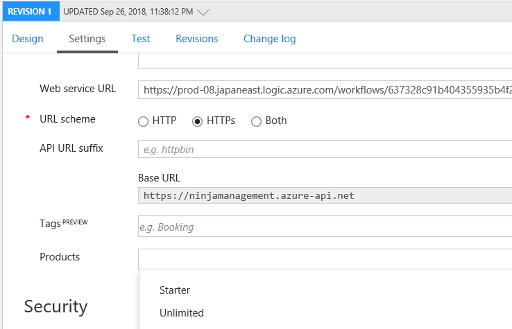

# Serverless Logic Apps Lab Setup

The following will setup the Logic App that the student will send messages to in the Lab.  This needs to be done at least a day before and can be resused for each delivery of the lab.

## Update Deployment template

1. Open the [template.json](template.json) file in an editor.

1. Save the template.json file.

## Use template to create Logic App and API Management

1. Browse to the azure portal [https://portal.azure.com](https://portal.azure.com)

1. Click the New button

    

1. Type "template" into the search box and select Logic App when it pops up

    

1. On the next blade select Template Deployment

    

1. Then click "Create"

    

1. Select "Build your own template in the editor"

    

1. Click "Load file"

    

1. Open the [template.json](template.json) file.

    

1. Press Save.

    

1. Press fill in the values, using the same resource group as the demo.

    

1. Select the terms and agreement check box.

    

1. Select purchase.

    

    Note:  API Management can take several minutes to create.

1. When the deployment finishes, we need to verify the Logic App. Click on the "go to resource" button of the deployment notification

    

1. Ensure all values are entered in the CosmosDB action item.

## Create API in API Management

1. Browse to the API Management resource.

Note:  API Management can take several minutes to create.

1. Open the API Management Resource.

1. From the right hand side of the API Management blade, select "APIs".

    

1. Under Add API, select Logic App.

    

1. Browse to the the Logic App just uploaded from the template. The Display Name and name will be populated based on the logic app name.  You can change the values if needed.

    

1. Select a the Unlimited option from the Products drop down box.

    

1. Select Create.

    

1. Select the settings tab.

    

1. Make note of the Base URL.  This URL will be given to the students.  Updating a file on Git, or writing the URL on the board.

    