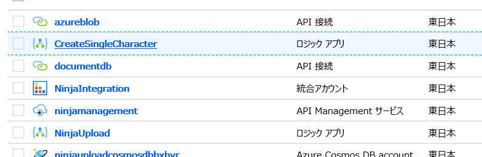
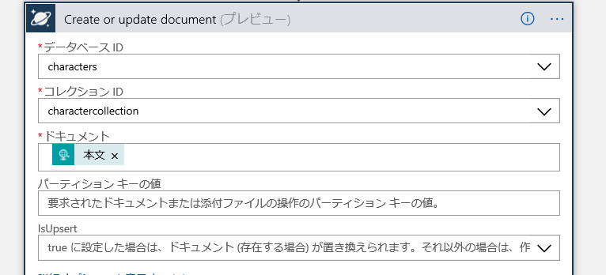
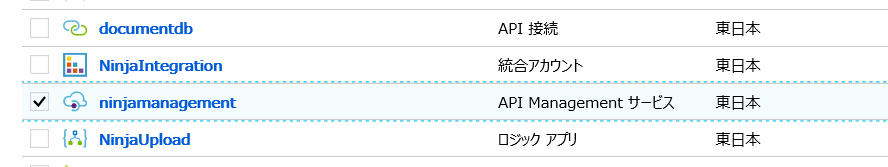
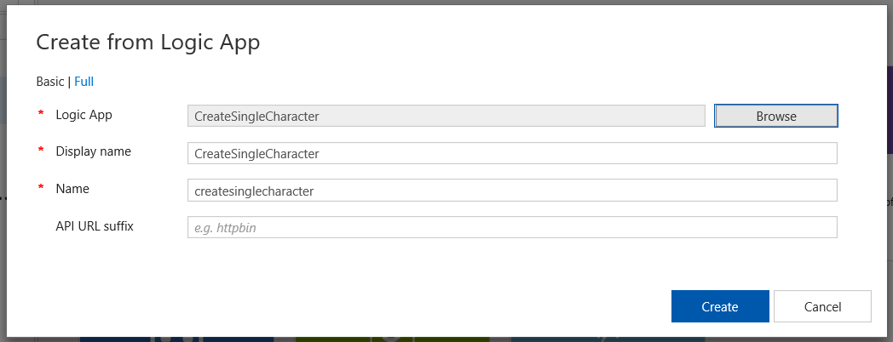
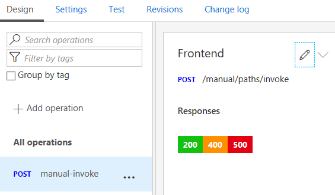
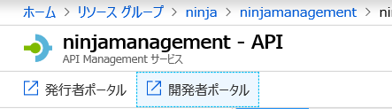
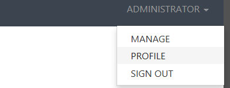
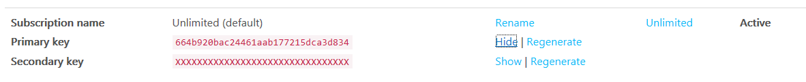

# サーバーレス ロジックアプリ ラボ セットアップ

以下の手順でこのラボに必要な環境を構築します。

## 展開テンプレートの保存

1. [template.json](template.json) を開きます。

1. ファイルをローカルに保存します。

## 展開テンプレートを使った環境の構築

1. Azure ポータルに接続。[https://portal.azure.com](https://portal.azure.com)

1. 「リソースの作成」をクリック。

    

1. 検索ボックスで "template" と入力して候補より選択。

    

1. 次の画面で「テンプレートのデプロイ」を選択。

    

1. 「作成」をクリック。

    

1. 「エディターで独自のテンプレートを作成する」を選択。

    

1. 「ファイルの読み込み」をクリック。

    

1. [template.json](template.json) を指定。

    

1. 「保存」をクリック。

    

1. パラメーターを指定。前のラボで作成した情報を再利用。Cosmos DB のキーやデータベース情報などは既存リソースの情報を参照。名前が異なる場合があるので注意。

    

1. 「使用条件」に同意して、「購入」をクリック。※API マネジメントの展開は10分単位で時間がかかる場合があります。コーヒーでも飲みに行きましょう。

    

    Note:  API Management can take several minutes to create.

1. 展開完了後、リソースグループより作成されたロジックアプリを選択。

    

1. ロジックアップデザイナーより、Cosmos DB の項目を展開し、テンプレートで指定したデータベース ID とコレクション ID が指定されていること、および接続情報を確認。異なる場合は「接続を変更してください」より変更。

    

## API マネジメントの構成

1. リソースグループより API Management を選択。

    

1. "API" メニューをクリック。

    

1. 「Add a new API」より「Logic App」を選択。

    

1. 「Browse」をクリックして、作成したロジックアプリを検索。 

    
    
1. 「Create」をクリック。

    

1. 「Settings」より「Products」で「Unlimited」を選択して「Save」をクリック。

1. Base URL が呼び出しのアドレスとなる。

    

1. 「Design」タブに戻って「All Operations」下の「POST」をクリック。Frontend に表示されるパスが呼び出し用のパスとなる。

    
    
1. 「開発者ポータル」をクリック。

    

1. 画面左の「ADMINISTRATOR」より「PROFILE」をクリック。

    
    
1. Unlimited サブスクリプションの Primary Key で「Show」ボタンをクリックしてキーを確認。後ほど使うため保存。

    
