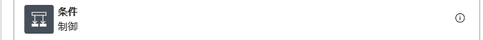

# サーバーレス ロジックアップ ハンズオンラボ 

このラボでは、選択したキャラクターの情報を送信するロジックアップを作成します。

ロジックアプリは Cosmos DB を検索した後、キャラクターが存在を確認して、その有無に応じて処理を行います。メッセージは Cosmos DB に保存されユーザーに応答が戻ります。

<b>このラボの開始前に、API Management とロジックアプリを 1 つ、[Logic App Lab Setup](LogicAppLabSetup.md) に沿って作ってください。</b>

## ラボのビデオ

以下のリンクからラボのウォークスルービデオが取得できます。

## ロジックアプリの作成

1. Azure ポータルに接続。[https://portal.azure.com](https://portal.azure.com)

1. 「リソースの作成」をクリック。

    

1. 検索ボックスに "Logic App" と入力して候補を選択。

    

1. 次の画面で Logic App を選択。

    

1. 「作成」をクリック。

    

1. 名前を設定し、既存のリソースグループを選択して「作成」をクリック。

    

1. 作成が完了したら、通知より「リソースに移動」をクリック。

    

1. 「ロジック アプリ デザイナー」より「繰り返し」テンプレートを選択。

    

Note: 繰り返しでロジックアプリが起動するため、ロジック起動のための追加の開発やソフトウェアの導入の必要がありません。

1. 繰り返しのインターバルを 1 分に変更。

    

1. 「新しいステップ」をクリック。

    

1. JSON メッセージを保持するため変数を利用。検索ボックスに「変数」と入力。

    

1. アクションより「変数を初期化する」を選択。

    

Note:  実際には HTTP トリガーの引数などで変数を受け取りますが、ここではロジックアプリ内で変数を作成しています。

1. 名前を入力して、種類より「文字列」を選択。

    

1. 「値」に [CheatSheet.txt](CheatSheet.txt) より JSON 部分の値をコピー。

    

1. 名前と ID、カテゴリに最低 2 つ値を入力。まだデータベースにない、ユニークな値を設定。

    

1. 「新しいステップ」をクリック。

    

1. 検索ボックスに 「json の解析」と入力。

    

1. アクションより「JSON の解析」を選択。

    

1. コンテンツのテキストボックスを選択し、「動的なコンテンツ」より「charactermessage」を選択。

    

1. 「サンプルのペイロードを使用してスキーマを生成する」リンクをクリック。

    

1. [CheatSheet.txt](CheatSheet.txt) より再度 JSON 部分をコピーして貼り付け、「完了」をクリック。

    

1. 次に Cosmos DB の検索を追加。「新しいステップ」を選択。

    

1. 検索ボックスに "cosmos" と入力。

    

1. アクションより「複数のドキュメントにクエリを実行する」を選択。

    

1. データベース ID とコレクションの設定。
   
    

1. クエリに「SELECT * FROM c where c.name ='」と入力。

    

1. 検索条件に「動的なコンテンツ」より「name」を指定。

    

1. 最後にシングルクォーテーションを追加してクエリを完成。

    

1. 「新しいステップ」を選択。

    

1. 「制御」をクリック。

    

1. 「条件」を選択。

    

1. 「値の選択」で「動的なコンテンツ」より「_count」を選択。

    

1. 条件で「次の値以上」を選択し、値の選択で「１」を入力。

    

1. 「true の場合」で「アクションの追加」をクリック。

    

1. 結果用のテキスト作成を行う。検索ボックスに「データ操作」と入力。

    

1. アクションより「作成」をクリック。

    

1. 入力テキストボックスに、「既にキャラクターが存在します」と入力。

    

1. 「false の場合」で「アクションの追加」をクリック。

    

1. 「HTTP」を選択。

    

1. アクションより HTTP を選択。

    

1. 「方法」より「POST」を選択。

    

1. ヘッダーの値に "Ocp-Apim-Subscription-Key" およびセットアップ時に取得したサブスクリプションキーを入力。※スペースが入らないように注意

    

1. URL にセットアップで取得した API Management のベースおよびパスを指定。

    

1. 本文に「動的なコンテンツ」から「charactermessage」を指定。

    

1. ロジックアプリを保存。

    

1. 「実行」ボタンをクリック。

    

1. 実行結果を確認。Cosmos DB に指定したキャラクターがいない場合作成される。

    
