# Serverless Logic Apps Hands On Lab

In this lab, students will create a logic app that sends a single json message of a character of the student's choosing.

The logic app searches through CosmosDB to determine if the character already exists and if not sends the message to another Logic App using HTTP.  The message is then saved into CosmosDB and a response is returned to the student.

We wrap up the lab by searching for a user's character in Cosmos DB.

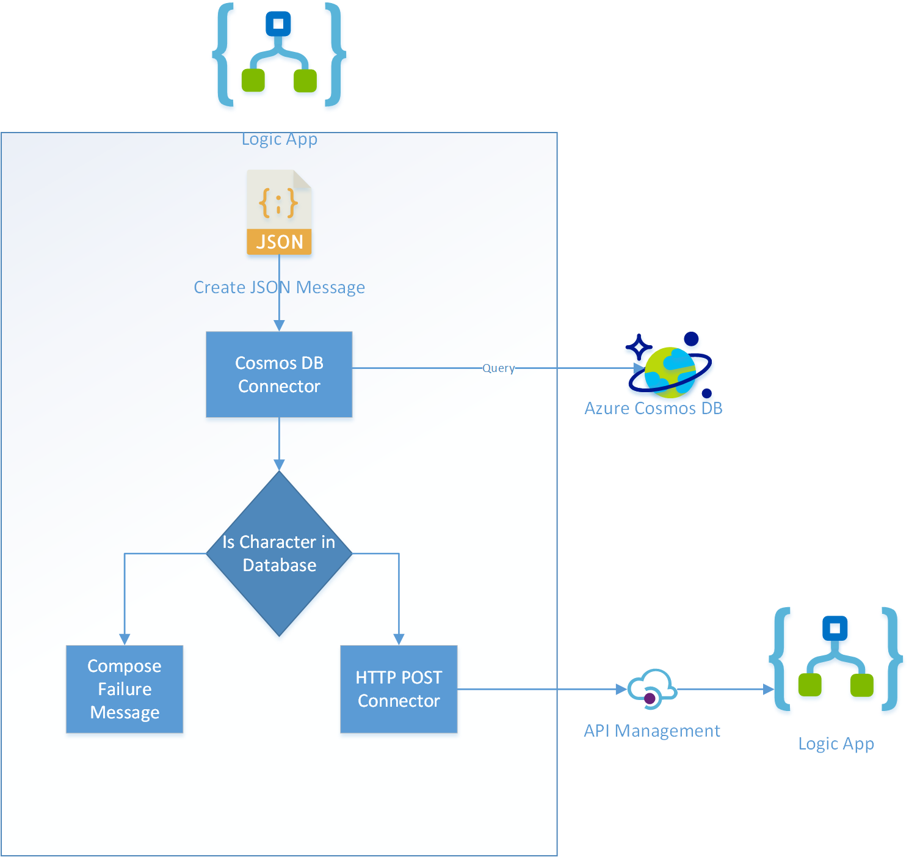

<b>This Lab builds on the Logic App Demo.  Before you start the lab you must create the API Management and SingleCharacerProcess Logic App found in the walk-through [Logic App Lab Setup](LogicAppLabSetup.md).</b>

## Video of Lab

Click image to download video of lab walk-through.

[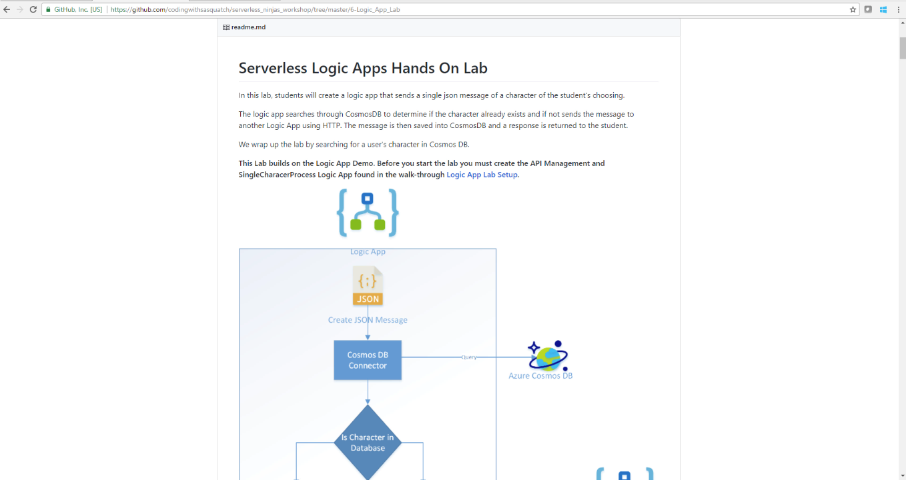](logic_app_lab.mp4)

## Create Logic App

1. Browse to the azure portal [https://portal.azure.com](https://portal.azure.com)
1. Click the New button

    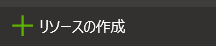

1. Type "Logic App" into the search box and select Logic App when it pops up

    

1. On the next blade select Logic App

    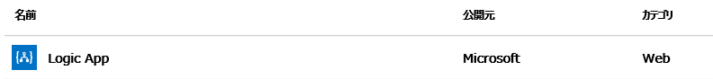

1. Then click "Create"

    

1. Give it a name, location, and a new Resource Group as our setup.  Then click Create.

    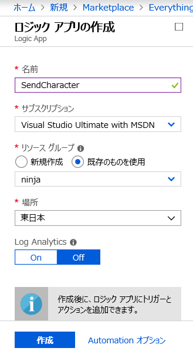

1. When the deployment finishes, we need to create the Logic App. Click on the "go to resource" button of the deployment notification

    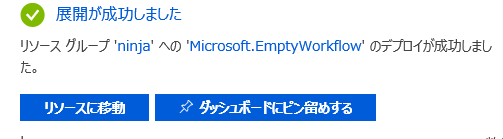

1. The Logic App opens to a designer page.  You can use a tempate to create a Logic App, and we will be using a Recurrence trigger.  The Recurrence template is located under the "Start with a common trigger secion."  Click on the "Recurrence" tile.

    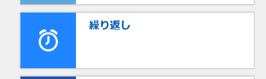

Note:  The logic app is starting with a recurrence trigger so that we have a way to activate the Logic App without requiering additional software installation.

1. On the Recurrence trigger, change the interval to 1 minute.

    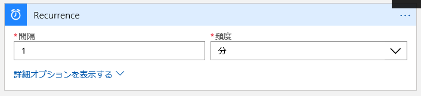

1. Select New Step and then Add an Action.

    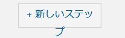

1. We will now create a variable that will store the JSON message that is uploaded into the Characters CosmosDB.  In the "Choose an action" search box, type "variable".

    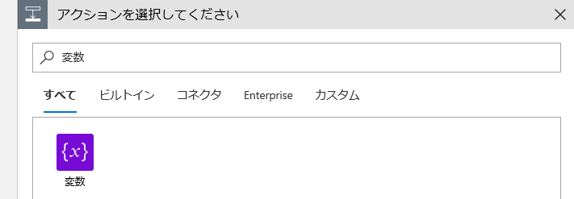

1. Under the Actions tab, select "Variables - Initialize variable"

    

Note:  Again this step is done so that addition software is not required.  A more realistic implementation would be to accept the message over an HTTP GET trigger.

1. Enter the name and change the type to "String"

    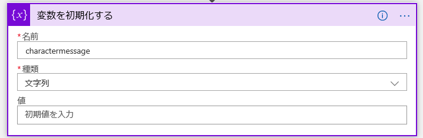

1. In the Value box, have the students copy the JSON message from [CheatSheet.txt](CheatSheet.txt) into the Value.

    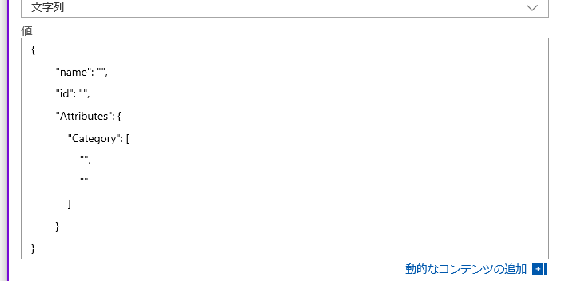

1. Put in a name of the the character, the ID, and two categories.  Emphasize to the students that they need to enter their own information.

    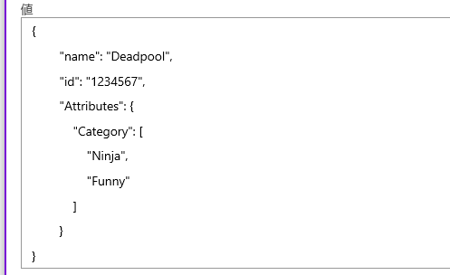

1. Put in a name of the the character, the ID, and two categories.  Emphasize to the students that they need to enter their own information.

    

1. Select New Step and then Add an Action.

    

Parse JSON is a commonly used action that will take a JSON message and strongly typed the message within the logic app.  The properties within the message can then be used in following actions.

1. In the "Choose an action" search box, type "parse json" with a space.

    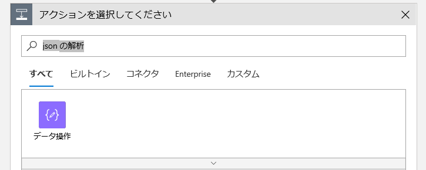

1. Under the Actions tab, select "Data Operations - Parse JSON".

    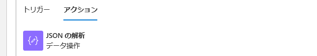

1. Click in the Content text box and select the variable name from the Dynamic content pop out.

    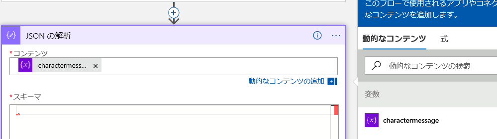

1. Click the link "Use sample payload to generate schema".

    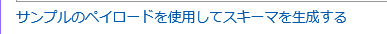

1. Copy the code from [CheatSheet.txt](CheatSheet.txt) and paste it into the editor.  Then press Done.

    

Next we will search Cosmos DB to verify that the character does not exist.

1. Select New Step and then Add an Action.

    

1. In the "Choose an action" search box, type "cosmos".

    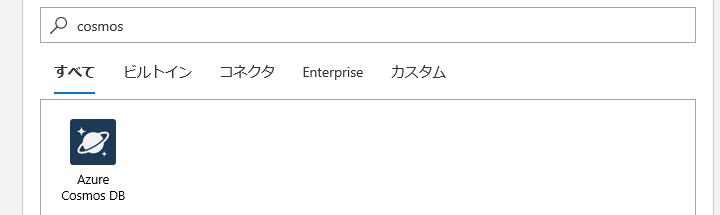

1. Under the Actions tab, scroll in the list and select "Azure Cosmos DB - Query documents".

    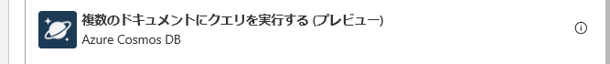

1. Click on Manually enter connection information.

    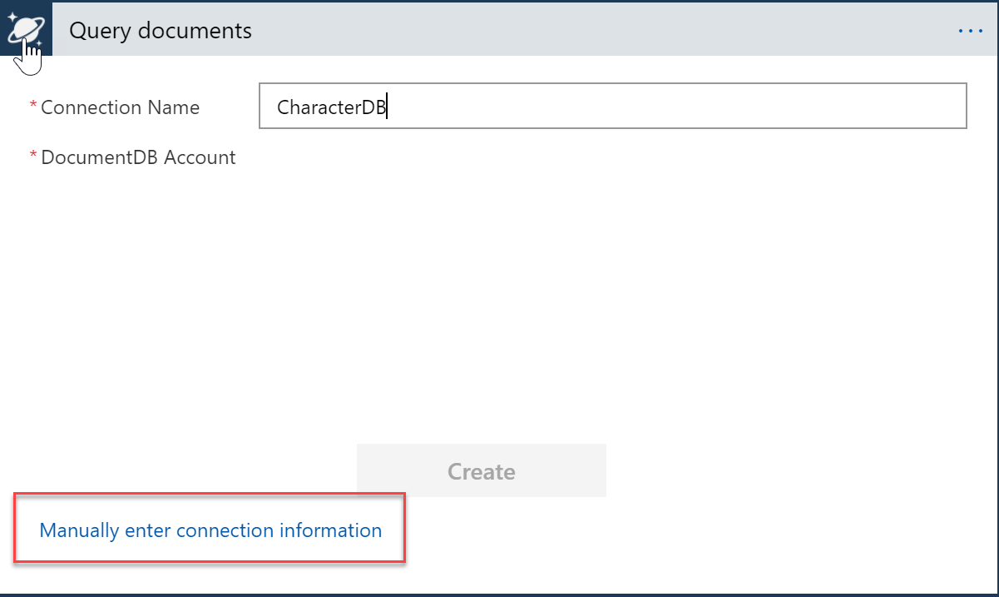

1. Enter a Connection Name, Account ID (stored in [CheatSheet.txt](CheatSheet.txt)), and the Access Key.  Then press Create.

    

1. In the drop down box of the Database ID, select the database.

    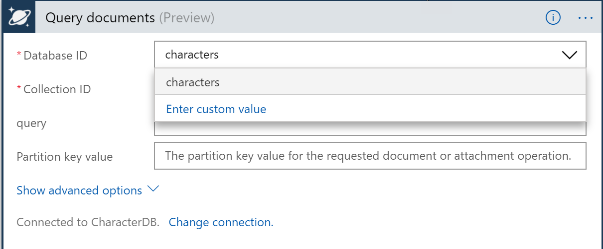

1. In the drop down box of the Collection ID, select the collection.

    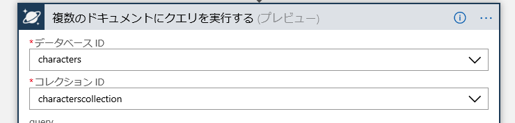

1. In the query type "SELECT * FROM c where c.name ='".

    

1. After the single quote select name from the Dynamic Content Under the Parse JSON.

    

1. Be sure to add the single quote after the name value.

    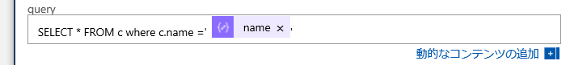

1. Select New Step.

    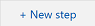

1. Then Select Add a Condition.

    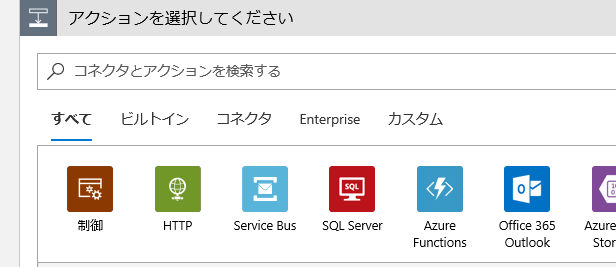

1. When the expression editor appears, select _count under the Dynamic content.

    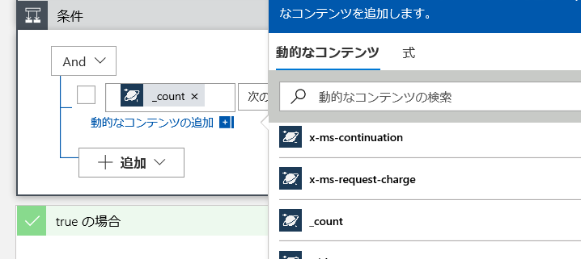

1. In the drop down box, select "is greater than or equal to"

    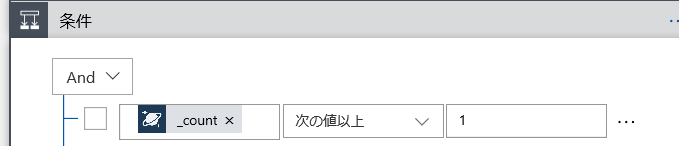

1. In the value box, enter 1.

    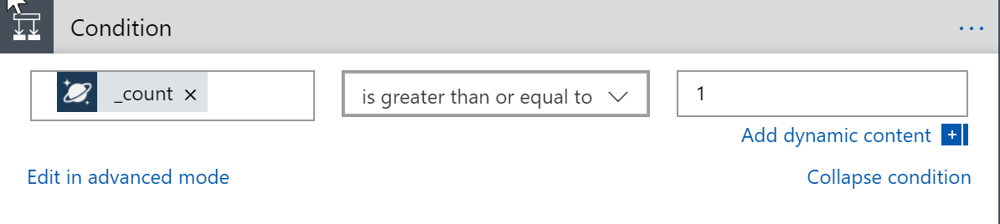

1. Under the If true box, select Add an action.

    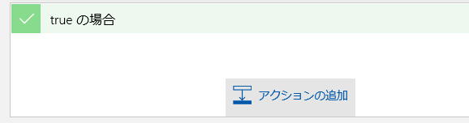

1. In the "Choose an action" search box, type "compose".

    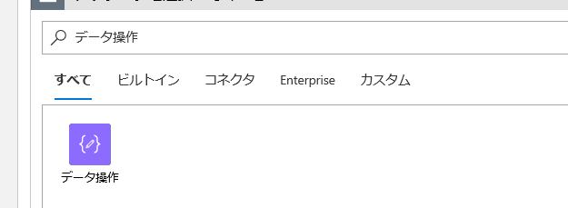

1. Under the Actions tab, scroll in the list and select "Data Operations - Compose".

    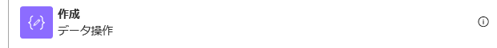

1. In the Inputs box, type a message saying the character already exists.

    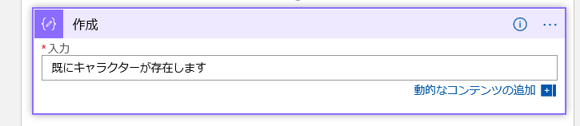

Compose is a common action used to create a new message that can be used in the workflow.

1. Under the If false box, select Add an action.

    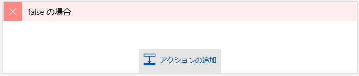

1. Under the Connectors, select HTTP.

    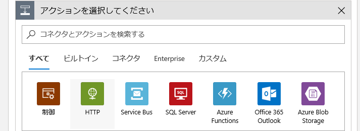

1. Under the Actions tab, scroll in the list and select "HTTP-HTTP".

    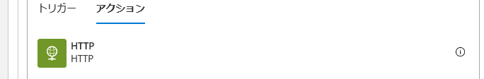

1. Select the POST method from the Method dropdown list.

    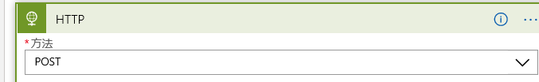

1. In the Headers values, select the "Enter key" text box and type "Ocp-Apim-Subscription-Key".  The information can be found [CheatSheet.txt](CheatSheet.txt)

    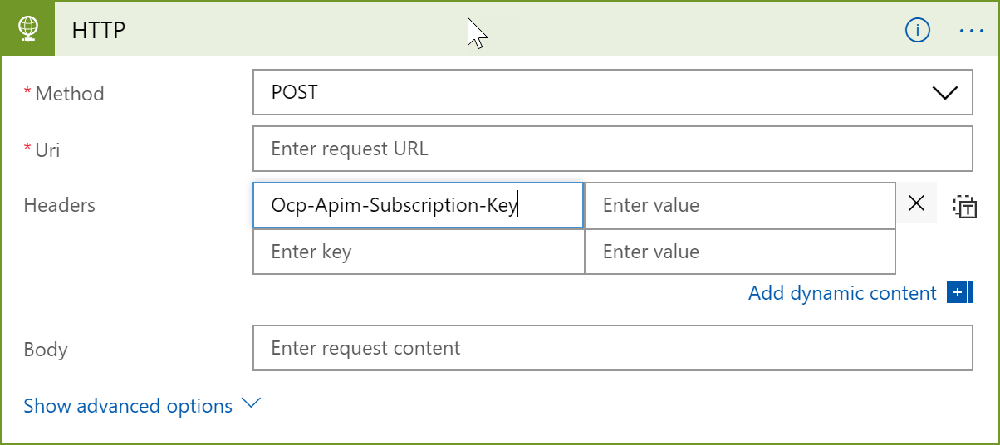

1. In the Headers values, select the "Enter value" text box and paste in the "Ocp-Apim-Subscription-Key" value found in [CheatSheet.txt](CheatSheet.txt)

    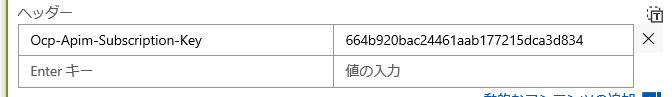

1. In the URI field, enter the URI from api-management that can be found found in [CheatSheet.txt](CheatSheet.txt)

    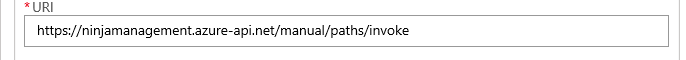

1. Click in the Body textbox, and select the variable name from the Dynamic Content pop up.

    

1. Save the Logic App.

    

1. Run the Logic App.

    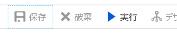

1. The students should see the logic app with green check marks.  The false statement should be executed first.  If not, have them change the ID value in the initalize variable.

    

At this point the instructure can open Azure Cosmos DB and search for the students character.