# Durable Functions Hands-On Lab

## Azure Portal Experience

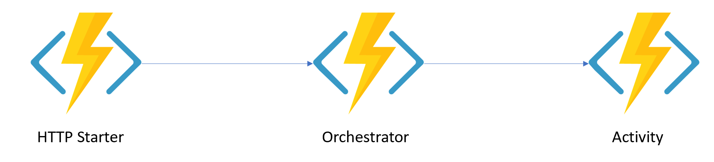

### Create Funcitons App

 Browse to the azure portal [https://portal.azure.com](https://portal.azure.com)
1. Click the New button

    

1. Type "azure functions" into the search box and select Event Hub when it pops up

    

1. On the next blade select Function App

    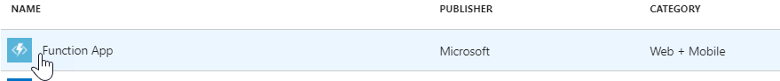

1. Then click "Create"

    

1. On the next screen select a unique name for your function app (confirm with checkmark), create new resource group, keep consumption plan selected for the hosting plan, and make sure you choose "On" for Application Insights and then click "Create"

### Modify Settings

Durable Functions are available in the Azure portal only after migrating to version 2 of the Azure Function Runtime. Version 2 is still in Preview. Please follow the instructions below.

1. After the app is created you can access it via the Funcitons button in the left menu

     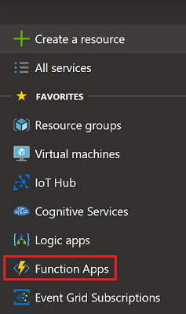

2. From the list select the funciton app you created and then select Function app settings
   
     

3. Next, select ~2 (Preview) for Runtime version. This will migrate the Functions runtime to version 2
    
    

### Create Durable Functions

In this section we will create the Durable Functions.

1. Select the function app from the left menu and create a new function

     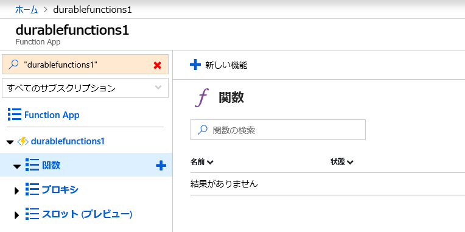

2. Pick the Custom function option

    

3. From the scenario dropdown select Durable Functions

    

4. We will need to create one of each Durable Functions type but let's start with Http Starter

     

5. Since this is the first Durable Function under the Function app, an extension should be installed

    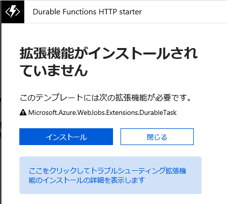

6. After pressing the install button it will take less than 2 minutes to complete

    

7. Press continue after the succesful installation

    

8. Let's complete the creation of the Http Start function and call it HttpStart

    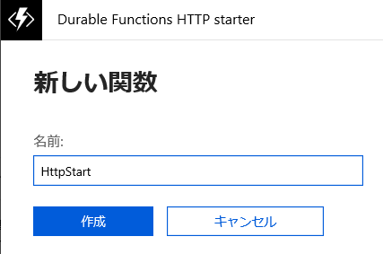

9. The Http Starter function comes with autogenerted code that extracts any objects sent in the payload, starts new orchestration and returns the standard set of endpoints for managing and checking the status of the orchestration 

    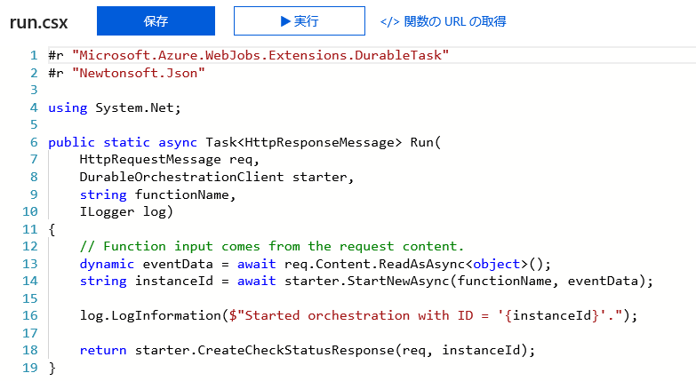

10. Next, let's create an activity function

    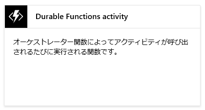

11. Pick the activity function option

    

12. Let's name it Hello

    

13. The autogenerated code is very simple and just appends hello to the name parameter 

    

14. The last function we need is the orchestrator. Start by adding new function under the function app

    

15. Select the Orchestrator type function

    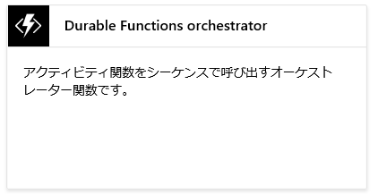

16. Let's name it Orchestrator

    

17. The autogenerated code calls three time Hello activity function with different parameters 

    

### Test Durable Functions

In this section we will test our first Durable Function in the Azure Portal

1. Select the HttpStart funciton under the function app. Then click on Test section and provide Orchestrator for function name. Finally click the Run button at the bottom

    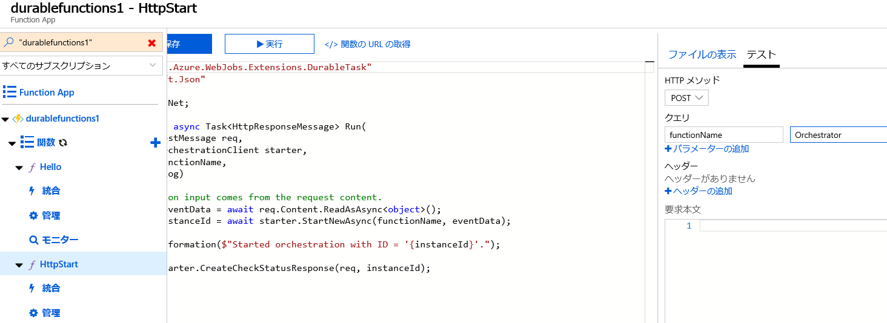

2. The output is an JSON object. Use the statusQueryGetUri to find the Durable Function output

    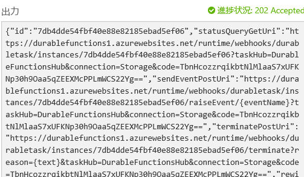

3. Open the link and you will get the orchestration output

    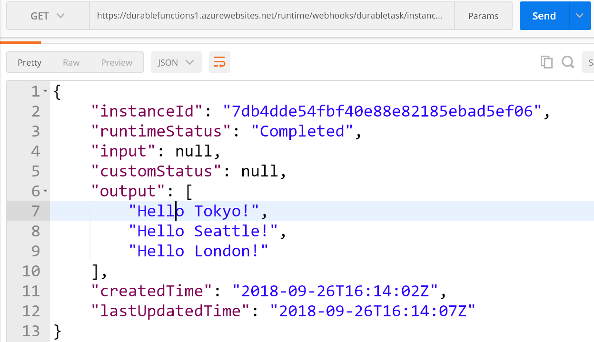

Congratulations! You created your first Durable Function and you successfully run your first orchestration! 

    
