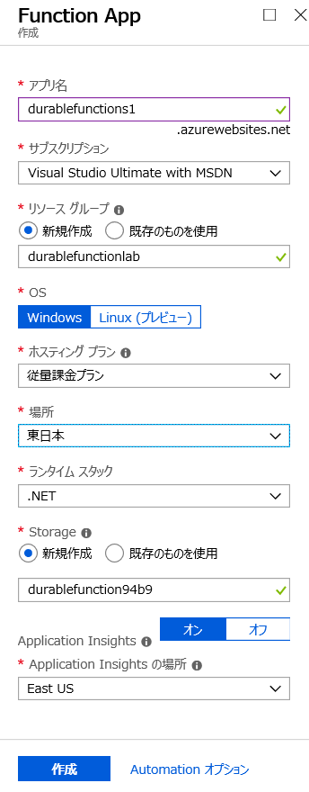

# Durable Functions ハンズオン ラボ

## Azure ポータルで Durable Functions

### Funciton の作成

1. Azure ポータルへ接続。[https://portal.azure.com](https://portal.azure.com)

1. 「リソースの作成」をクリック。

    

1. 検索ボックスで function app と入力して候補を選択。

    

1. 次の画面で Function App を選択。

    

1. 「作成」をクリック。

    

1. 名前を付け、新規のリソースグループを指定。また「ランタイムスタック」は「.NET」を指定して「作成」をクリック。

    

### Durable Functions を作成

このセクションでは実際に Durable Functions を作成します。

1. 作成した Function App を選択して、左の関数をクリック。「新しい機能」をクリック。

     

1. 「Durable Functions HTTP starter」を選択。

     

1. 拡張機能がインストールされていない場合は「インストール」をクリック。

    

1. インストール完了後、「続行」をクリック。

    

1. 名前を付けて「作成」をクリック。

    

1. テンプレートは HTTP リクエストからトリガーされるオーケストレーションコードを含んでいる。

    

1. 次に Activity Function を作成。再度「新しい機能」より「Durable Functions activity」を選択。

    

1. 名前を付けて「作成」をクリック。

    

1. 自動生成されるコードは、名前に Hello を付けるだけのシンプルなサンプル。 

    

1. 最後にオーケストレーターを追加。再度「新しい機能」より「Durable Functions orchestrator」を選択。

    

1. 名前を付けて「作成」をクリック。

    

1. オーケストレーターでは複数回 Hello 関数を呼ぶコードが自動で生成される。

    

### Durable Functions のテスト

このセクションでは上記で作成した Durable Functions 

1. 関数の一覧より HttpStart を選択して、「テスト」タブをクリック。functionName クエリに "Orchestrator" を引数として設定して「実行」をクリック。
    
    

1. 出力に表示された JSON より statusQueryGetUri の項目で Durable Functions の内容を確認。

    

3. リンクを Postman やブラウザなどで実行し結果を確認。

    

これでまず初めのラボは完了です。

### 参考 

[Durable Functions Documentation](https://docs.microsoft.com/en-us/azure/azure-functions/durable-functions-overview)

[Durable Functions GitHub Repository](https://github.com/Azure/azure-functions-durable-extension)

[Durable Functions JavaScript GitHub Repository](https://github.com/Azure/azure-functions-durable-js)

[Durable Functions Samples Install](https://docs.microsoft.com/en-us/azure/azure-functions/durable-functions-install)

    
